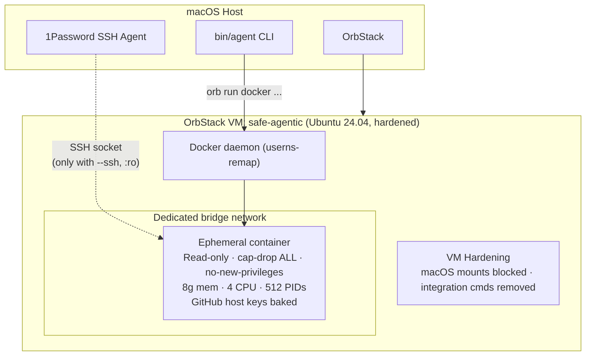

# safe-agentic

Isolated environment for running AI coding agents (Claude Code, Codex) safely. Safe by default: SSH forwarding is opt-in, auth is ephemeral unless reused explicitly, containers run read-only with all Linux capabilities dropped, `no-new-privileges`, dedicated per-session networks get egress guardrails, images are local-only at launch, and resource limits apply.

## Architecture



> **[Full architecture docs](docs/architecture.md)** — system overview, component map, sequence diagrams for setup, spawn, SSH auth, OAuth, container lifecycle, and image build.

## Threat model

**Goal:** Protect your macOS host and repos from unintended agent side-effects. Safe by default — dangerous features require explicit opt-in.

**What this protects against:**
- Agents modifying files outside their cloned repo (read-only rootfs + per-agent workspace volume)
- Agents accessing your macOS filesystem (VM hardened: macOS mounts blocked)
- Agents interfering with each other (per-agent containers, networks, auth)
- Agents reaching VM/private-network services by default (managed bridges block local/private egress and only allow TCP 22/80/443)
- Credential exposure (SSH agent OFF by default, per-session OAuth tokens)
- SSH MITM (GitHub host keys baked into image, StrictHostKeyChecking yes)
- Container privilege escalation (capabilities dropped, no sudo)

**Opt-in flags that widen the attack surface:**
- `--ssh` — Forwards SSH agent into container. Required for `git@` repos. A compromised agent could use SSH keys for other operations.
- `--reuse-auth` — Shares OAuth token volume across sessions. Compromised container could steal the token.
- `--network <name>` — Joins an existing Docker network in the VM and bypasses the default managed-network egress guardrails. Use only for deliberately shared or isolated networks you created.

**Known limitations:**
- **OrbStack hardening is best-effort.** OrbStack does not yet support per-VM file sharing disable ([#169](https://github.com/orbstack/orbstack/issues/169)). `vm/setup.sh` mounts tmpfs over macOS paths and removes mac commands, but OrbStack may re-enable sharing on VM restart. Re-run `agent setup` after VM restarts, and disable file sharing in OrbStack UI (Settings > Linux) for defense-in-depth.
- **`--dangerously-skip-permissions` is broad.** Claude Code in this mode can execute any command inside the container. With `--ssh`, a malicious repo could push to other repos or exfiltrate data over the network.
- **Codex yolo mode is equally broad.** Codex runs with `--yolo`, so it can execute any command inside the container. With `--ssh`, a malicious repo could push to other repos or exfiltrate data over the network.
- **Build chain still trusts upstream signing roots and registries.** Direct-download binaries are pinned and checksum-verified; apt repos are signed; npm packages are lockfile-pinned. A compromised upstream signing chain could still affect builds.

**For untrusted repos:**
```bash
# Create an isolated Docker network with no internet access (one-time)
agent vm ssh
docker network create --internal agent-isolated
exit

# Spawn without SSH, on isolated network
agent spawn claude --repo <untrusted-repo> --network agent-isolated
```

## Prerequisites

1. **OrbStack**: `brew install orbstack`
2. **1Password Desktop App** (for SSH keys):
   - Settings → Developer → Enable "Use the SSH Agent"
   - SSH key for GitHub configured in 1Password
3. **PATH**: Add `safe-agentic/bin` to your shell:
   ```bash
   export PATH="$PATH:/path/to/safe-agentic/bin"
   ```

## Setup

```bash
agent setup
```

Creates OrbStack VM, hardens it, installs Docker, builds the agent image.

**After VM restarts:** Run `agent vm start` (auto re-applies hardening).

## Usage

### Spawn an agent

```bash
# Claude Code with SSH (required for git@ repos)
agent spawn claude --ssh --repo git@github.com:myorg/myrepo.git

# HTTPS repo without SSH forwarding
agent spawn claude --repo https://github.com/myorg/myrepo.git

# Codex with persistent auth (skip OAuth next time)
agent spawn codex --ssh --reuse-auth --repo git@github.com:myorg/myrepo.git

# Named session
agent spawn claude --ssh --repo git@github.com:myorg/api.git --name api-refactor

# Multiple repos (cloned as org/repo to avoid name collisions)
agent spawn claude --ssh --repo git@github.com:myorg/api.git --repo git@github.com:other/api.git

# Quick aliases (auto-enable --ssh only for SSH repos)
agent-claude git@github.com:myorg/myrepo.git
agent-codex git@github.com:myorg/myrepo.git

# Untrusted repo — no SSH, isolated network
agent spawn claude --repo https://github.com/myorg/untrusted.git --network agent-isolated

# Tune limits explicitly when needed
agent shell --repo https://github.com/myorg/myrepo.git --memory 12g --cpus 6
```

### Manage agents

```bash
agent list                  # List running agents
agent attach <name>         # Open second shell in running agent
agent stop <name>           # Stop specific agent
agent stop --all            # Stop all agents
agent cleanup               # Stop all + remove shared auth + prune managed networks
```

### Interactive shell (no agent, no auth)

```bash
agent shell --ssh --repo git@github.com:myorg/myrepo.git
```

### Maintenance

```bash
agent update                # Rebuild image
agent update --quick        # Rebuild AI CLI layer only (fast)
agent update --full         # Full rebuild, no cache
```

### VM management

```bash
agent vm ssh                # SSH into the VM for debugging
agent vm stop               # Stop the VM
agent vm start              # Start the VM (re-applies hardening)
```

## Tools included

### AI Agents
- Claude Code (`claude`)
- Codex (`codex`)

### SRE/DevOps
terraform, kubectl, helm, aws-cli, vault, k9s

### Modern CLI
ripgrep (`rg`), fd, bat, eza, zoxide (`z`), fzf, jq, yq, delta, gh

### Runtimes
Node.js 22, Python 3.12, Go 1.23

## Security defaults

| Feature | Default | Override |
|---------|---------|----------|
| SSH agent | OFF | `--ssh` |
| Auth persistence | Ephemeral per-session volume | `--reuse-auth` |
| Root filesystem | Read-only | — |
| Capabilities | Dropped (`ALL`) + `no-new-privileges` | — |
| Network | Dedicated per-container bridge with local/private egress blocked; TCP 22/80/443 only | `--network <name>` |
| Resource limits | `--memory 8g --cpus 4 --pids-limit 512` | explicit flags |
| GitHub host keys | Baked & pinned (StrictHostKeyChecking yes) | — |
| Workspace/auth/cache volumes | Ephemeral | `--reuse-auth` for auth only |
| Sudo | Removed | — |

## How auth works

### Claude Code / Codex (OAuth)

On first `agent spawn`, the CLI shows an OAuth URL. Open it in your macOS browser to authenticate with your subscription.

- **Default**: OAuth token is stored in an anonymous per-session volume. You log in each time. Container exit discards the token.
- **`--reuse-auth`**: Token persists in a shared volume (`agent-claude-auth` / `agent-codex-auth`). Log in once, reuse across sessions.

### Git (SSH via 1Password)

Only available when `--ssh` is passed:
```
git clone/push inside container
  → SSH agent socket forwarded: container → VM → macOS → 1Password
  → Uses SSH keys managed by 1Password
```

GitHub host keys are baked into the image with `StrictHostKeyChecking yes` — no trust-on-first-use.

### Git identity

Containers default to neutral git identity (`Agent <agent@localhost>`). Your host git `user.name` / `user.email` are no longer copied in automatically.

If you want explicit attribution, export it before launch:

```bash
GIT_AUTHOR_NAME="Your Name" \
GIT_AUTHOR_EMAIL="you@example.com" \
agent spawn claude --repo https://github.com/myorg/myrepo.git
```

`GIT_COMMITTER_NAME` / `GIT_COMMITTER_EMAIL` are also honored if you set them explicitly.

### Launch behavior

`agent spawn` / `agent shell` now require the VM to already have `safe-agentic:latest`. They will not auto-pull from a registry. If the image is missing, run `agent update` or `agent setup`.

### Build context safety

`agent update` sends only git-tracked files that exist on disk to the VM. Untracked files (including `.env` or scratch files) are excluded from the build context.

## More docs

- **[Quickstart](docs/quickstart.md)** — from zero to a sandboxed agent in 5 minutes
- **[Architecture](docs/architecture.md)** — system diagrams, component map, sequence flows
- **[Usage guide](docs/usage.md)** — all commands, options, and workflows
- **[Security model](docs/security.md)** — isolation boundaries, threat model, supply chain hardening
