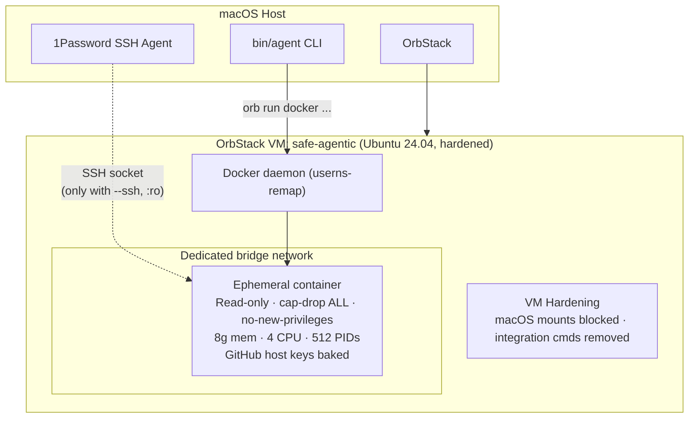

# safe-agentic

Isolated environment for running AI coding agents (Claude Code, Codex) safely. Safe by default: SSH forwarding is opt-in, auth is ephemeral unless reused explicitly, containers run read-only with all Linux capabilities dropped, `no-new-privileges`, dedicated per-session networks get egress guardrails, images are local-only at launch, and resource limits apply.

## Features

**Isolation & Security**
- Three isolation boundaries: macOS ↔ VM (OrbStack + hardening), VM ↔ container (Docker + userns-remap), container ↔ container (separate volumes/networks/namespaces)
- Read-only rootfs, `cap-drop ALL`, `no-new-privileges`, seccomp profile
- Per-container dedicated bridge networks with egress guardrails (TCP 22/80/443 only)
- VM hardening: macOS filesystem mounts blocked, integration commands removed
- Docker userns-remap: container UIDs remapped to unprivileged host UIDs
- GitHub SSH host keys baked with `StrictHostKeyChecking yes` — no TOFU
- Resource limits: memory, CPU, PIDs (configurable per-container)
- Build context safety: only git-tracked files sent to VM

**Agent Lifecycle**
- `--prompt 'task'` — send an initial task so the agent starts working immediately
- Tmux-backed reattach — `agent attach`/TUI resume reopen the live agent session; detach with `Ctrl-b d`
- Container persistence — containers survive exit, `agent attach` restarts stopped ones
- `agent list` — show running + stopped containers with metadata
- `agent stop` / `agent cleanup` — stop, remove, and clean up resources
- `agent cp` — extract files, logs, or build artifacts from containers
- `agent sessions` — export session history for archival
- `agent diagnose` — health check for OrbStack, VM, Docker, image, SSH, defaults

**Developer Workflow**
- `agent diff` — show git diff from an agent's working tree
- `agent checkpoint` — create/list/revert working tree snapshots (git stash refs)
- `agent todo` — track merge requirements; blocks PR creation until all checked off
- `agent pr` — create a GitHub PR from the agent's branch (push + `gh pr create`)
- `agent review` — AI code review via `codex review` or raw diff fallback
- `safe-agentic.json` — lifecycle scripts (`setup` runs after repo clone)

**Fleet & Orchestration**
- `agent fleet manifest.yaml` — spawn multiple agents from a YAML manifest
- `agent pipeline pipeline.yaml` — multi-step workflows with retry, dependencies, failure handlers

**Analytics**
- `agent cost` — estimate API spend by parsing session token usage
- `agent audit` — append-only JSONL log of all spawn/stop/attach operations

**Auth & Config**
- `--ssh` — SSH agent forwarding via socat relay (userns-remap compatible)
- `--reuse-auth` — persist Claude/Codex OAuth tokens across sessions
- `--reuse-gh-auth` — persist GitHub CLI auth across sessions
- `--aws <profile>` — inject AWS credentials from `~/.aws/credentials`; refresh with `agent aws-refresh`
- `agent mcp-login` — MCP OAuth login (Linear, Notion, etc.) with token persistence
- Host config auto-injection: `~/.codex/config.toml` and `~/.claude/settings.json` carry MCP servers, model settings, features, and plugins into containers
- `--identity` — explicit git author/committer attribution
- `defaults.sh` — persistent defaults for memory, CPU, network, Docker, auth, identity

**Docker & Networking**
- `--docker` — per-session Docker-in-Docker sidecar
- `--docker-socket` — direct VM Docker daemon access
- `--network` — join custom or isolated Docker networks
- Quick aliases: `agent-claude` / `agent-codex` with auto SSH detection
- Multi-repo support: clone multiple repos into a single container

**Tools Included**
- AI agents: Claude Code, Codex
- SRE/DevOps: terraform, kubectl, helm, aws-cli, vault, docker, compose
- Modern CLI: ripgrep, fd, bat, eza, zoxide, fzf, jq, yq, delta, gh, socat
- Runtimes: Node.js 22, pnpm, Bun, Python 3.12, Go 1.23

## Quick Start

```bash
agent setup
agent-claude git@github.com:myorg/myrepo.git
agent diagnose
```

- `agent-claude` / `agent-codex` auto-enable `--ssh` for `git@` and `ssh://` repos
- add `--reuse-auth` to keep Claude/Codex OAuth between sessions
- add `--reuse-gh-auth` to keep `gh auth login` state between sessions
- add `--prompt 'task'` to send an initial task to the agent
- add `--aws <profile>` to inject AWS credentials; refresh with `agent aws-refresh <name>`
- add `--docker` for Docker-in-Docker, or `--docker-socket` to mount the VM daemon directly
- add `--identity 'You <you@example.com>'` to avoid `Agent <agent@localhost>` commits
- host `~/.codex/config.toml` and `~/.claude/settings.json` are auto-injected into containers (MCP servers, model settings carry over)
- containers persist after exit — `agent attach` restarts stopped ones; tmux sessions detach with `Ctrl-b d`
- put defaults in `~/.config/safe-agentic/defaults.sh` for memory, CPUs, network, Docker mode, shared auth, and git identity
  - format: simple `KEY=value` lines only; no shell snippets

## Architecture



> **[Full architecture docs](docs/architecture.md)** — system overview, component map, sequence diagrams for setup, spawn, SSH auth, OAuth, container lifecycle, and image build.

## Threat model

**Goal:** Protect your macOS host and repos from unintended agent side-effects. Safe by default — dangerous features require explicit opt-in.

**What this protects against:**
- Agents modifying files outside their cloned repo (read-only rootfs + per-agent workspace volume)
- Agents accessing your macOS filesystem (VM hardened: macOS mounts blocked)
- Agents interfering with each other (per-agent containers, networks, auth)
- Agents reaching VM/private-network services by default (managed bridges block local/private egress and only allow TCP 22/80/443)
- Credential exposure (SSH agent OFF by default, per-session OAuth tokens)
- SSH MITM (GitHub host keys baked into image, StrictHostKeyChecking yes)
- Container privilege escalation (capabilities dropped, no sudo)

**Opt-in flags that widen the attack surface:**
- `--ssh` — Forwards SSH agent into container. Required for `git@` repos. A compromised agent could use SSH keys for other operations.
- `--reuse-auth` — Shares OAuth token volume across sessions. Compromised container could steal the token.
- `--reuse-gh-auth` — Shares GitHub CLI auth volume across sessions. Compromised container could steal the token.
- `--docker` — Starts a privileged Docker-in-Docker sidecar for the session. Needed only when the agent must build or run containers itself.
- `--docker-socket` — Mounts the VM Docker socket directly. Broadest Docker access; the agent can control the VM daemon.
- `--aws <profile>` — Injects AWS credentials from `~/.aws/credentials` into the container. Credentials are written to a tmpfs; a compromised container could use them to access AWS resources for the session duration.
- `--network <name>` — Joins an existing Docker network in the VM and bypasses the default managed-network egress guardrails. Use only for deliberately shared or isolated networks you created.

**Known limitations:**
- **OrbStack hardening is best-effort.** OrbStack does not yet support per-VM file sharing disable ([#169](https://github.com/orbstack/orbstack/issues/169)). `vm/setup.sh` mounts tmpfs over macOS paths and removes mac commands, but OrbStack may re-enable sharing on VM restart. Re-run `agent setup` after VM restarts, and disable file sharing in OrbStack UI (Settings > Linux) for defense-in-depth.
- **`--dangerously-skip-permissions` is broad.** Claude Code in this mode can execute any command inside the container. With `--ssh`, a malicious repo could push to other repos or exfiltrate data over the network.
- **Codex yolo mode is equally broad.** Codex runs with `--yolo`, so it can execute any command inside the container. With `--ssh`, a malicious repo could push to other repos or exfiltrate data over the network.
- **Build chain still trusts upstream signing roots and registries.** Direct-download binaries are pinned and checksum-verified; apt repos are signed; npm packages are lockfile-pinned. A compromised upstream signing chain could still affect builds.

**For untrusted repos:**
```bash
# Create an isolated Docker network with no internet access (one-time)
agent vm ssh
docker network create --internal agent-isolated
exit

# Spawn without SSH, on isolated network
agent spawn claude --repo <untrusted-repo> --network agent-isolated
```

## Prerequisites

1. **OrbStack**: `brew install orbstack`
2. **1Password Desktop App** (for SSH keys):
   - Settings → Developer → Enable "Use the SSH Agent"
   - SSH key for GitHub configured in 1Password
3. **PATH**: Add `safe-agentic/bin` to your shell:
   ```bash
   export PATH="$PATH:/path/to/safe-agentic/bin"
   ```

## Setup

```bash
agent setup
```

Creates OrbStack VM, hardens it, installs Docker, builds the agent image. Progress now prints numbered phases during VM bootstrap and image build.

**After VM restarts:** Run `agent vm start` (auto re-applies hardening).

## Usage

### Spawn an agent

```bash
# Claude Code with SSH (required for git@ repos)
agent spawn claude --ssh --repo git@github.com:myorg/myrepo.git

# HTTPS repo without SSH forwarding
agent spawn claude --repo https://github.com/myorg/myrepo.git

# Codex with persistent auth (skip OAuth next time)
agent spawn codex --ssh --reuse-auth --repo git@github.com:myorg/myrepo.git

# Reuse GitHub CLI auth too
agent spawn codex --ssh --reuse-auth --reuse-gh-auth --repo git@github.com:myorg/myrepo.git

# Docker support: DinD by default, host socket only when you ask for it
agent shell --docker --repo https://github.com/myorg/myrepo.git
agent shell --docker-socket --repo https://github.com/myorg/myrepo.git

# Named session
agent spawn claude --ssh --repo git@github.com:myorg/api.git --name api-refactor

# Multiple repos (cloned as org/repo to avoid name collisions)
agent spawn claude --ssh --repo git@github.com:myorg/api.git --repo git@github.com:other/api.git

# Quick aliases (auto-enable --ssh only for SSH repos)
agent-claude git@github.com:myorg/myrepo.git
agent-codex git@github.com:myorg/myrepo.git

# Advanced alias usage still works
agent-claude --name api-fix --reuse-auth --identity 'You <you@example.com>' git@github.com:myorg/api.git

# Untrusted repo — no SSH, isolated network
agent spawn claude --repo https://github.com/myorg/untrusted.git --network agent-isolated

# Tune limits explicitly when needed
agent shell --repo https://github.com/myorg/myrepo.git --memory 12g --cpus 6
```

### Manage agents

```bash
agent list                  # List running + stopped agents
agent attach <name>         # Tmux attach (restarts stopped containers)
agent attach --latest       # Attach to newest agent
agent cp <name> <container-path> <host-path>  # Copy files out safely
agent cp --latest <container-path> <host-path>
agent stop <name>           # Stop and remove specific agent
agent stop --latest         # Stop and remove newest agent
agent stop --all            # Stop and remove all agents
agent cleanup               # Stop all + keep shared auth + prune managed networks
agent cleanup --auth        # Also remove shared auth volumes
agent mcp-login <server>    # MCP OAuth login (persists in auth volume)
agent sessions <name>       # Export session history from container
agent peek <name>            # Show last 30 lines of agent's tmux pane
agent peek --latest --lines 50
agent aws-refresh <name>    # Refresh AWS credentials in running container
agent diagnose              # Check orb/VM/docker/image/SSH/defaults
```

Use `agent cp` when you need logs, test output, or build artifacts on the host without adding bind mounts:

```bash
agent cp api-refactor /workspace/tmp/test.log ./test.log
agent cp --latest /workspace/dist ./dist
```

Older `agent cleanup` removed shared auth volumes too. Full reset now needs `agent cleanup --auth`.

Claude and Codex sessions run inside `tmux` in the container with a large scrollback buffer. Detach with `Ctrl-b d`; reattach later with `agent attach` or the TUI.

### Interactive shell (no agent, no auth)

```bash
agent shell --ssh --repo git@github.com:myorg/myrepo.git
```

### Maintenance

```bash
agent update                # Rebuild image
agent update --quick        # Rebuild AI CLI layer only (fast)
agent update --full         # Full rebuild, no cache
```

### VM management

```bash
agent vm ssh                # SSH into the VM for debugging
agent vm stop               # Stop the VM
agent vm start              # Start the VM (re-applies hardening)
```

## Tools included

### AI Agents
- Claude Code (`claude`)
- Codex (`codex`)

### SRE/DevOps
terraform, kubectl, helm, aws-cli, vault, docker, docker compose

### Modern CLI
ripgrep (`rg`), fd, bat, eza, zoxide (`z`), fzf, jq, yq, delta, gh

### Runtimes
Node.js 22, `pnpm`, Bun, Python 3.12, Go 1.23

## Security defaults

| Feature | Default | Override |
|---------|---------|----------|
| SSH agent | OFF | `--ssh` (socat relay for userns-remap compat) |
| Auth persistence | Ephemeral per-session volume | `--reuse-auth` |
| GitHub CLI auth | Ephemeral per-session volume | `--reuse-gh-auth` |
| AWS credentials | OFF | `--aws <profile>` (tmpfs-backed, refresh with `agent aws-refresh`) |
| Docker access | OFF | `--docker` (DinD) / `--docker-socket` |
| Root filesystem | Read-only | — |
| Capabilities | Dropped (`ALL`) + `no-new-privileges` | — |
| Network | Dedicated per-container bridge with local/private egress blocked; TCP 22/80/443 only | `--network <name>` |
| Resource limits | `--memory 8g --cpus 4 --pids-limit 512` | explicit flags |
| GitHub host keys | Baked & pinned (StrictHostKeyChecking yes) | — |
| Workspace/auth/cache volumes | Ephemeral | `--reuse-auth` / `--reuse-gh-auth` for auth only |
| Sudo | Removed | — |

## How auth works

### Claude Code / Codex (OAuth)

On first `agent spawn`, the CLI shows an OAuth URL. Open it in your macOS browser to authenticate with your subscription.

- **Default**: OAuth token is stored in an anonymous per-session volume. You log in each time. Container exit discards the token.
- **`--reuse-auth`**: Token persists in a shared volume (`agent-claude-auth` / `agent-codex-auth`). Log in once, reuse across sessions.

### GitHub CLI (`gh`)

`gh` is installed in the image.

- **Default**: `gh auth login` state lives in an anonymous per-session volume at `/home/agent/.config/gh`.
- **`--reuse-gh-auth`**: GitHub CLI auth persists in `agent-gh-auth`. Reuse across sessions; remove with `agent cleanup --auth`.

### Git (SSH via 1Password)

Only available when `--ssh` is passed:
```
git clone/push inside container
  → SSH agent socket forwarded: container → socat relay (VM) → macOS → 1Password
  → Uses SSH keys managed by 1Password
  → socat relay bridges userns-remap UID permissions
```

GitHub host keys are baked into the image with `StrictHostKeyChecking yes` — no trust-on-first-use.

### Git identity

Containers default to neutral git identity (`Agent <agent@localhost>`). Your host git `user.name` / `user.email` are no longer copied in automatically.

If you want explicit attribution, export it before launch:

```bash
GIT_AUTHOR_NAME="Your Name" \
GIT_AUTHOR_EMAIL="you@example.com" \
agent spawn claude --repo https://github.com/myorg/myrepo.git
```

`GIT_COMMITTER_NAME` / `GIT_COMMITTER_EMAIL` are also honored if you set them explicitly.

Or use a one-off flag:

```bash
agent spawn claude --identity "Your Name <you@example.com>" --repo https://github.com/myorg/myrepo.git
```

Or set persistent defaults in `${XDG_CONFIG_HOME:-~/.config}/safe-agentic/defaults.sh`:

```bash
SAFE_AGENTIC_DEFAULT_MEMORY=16g
SAFE_AGENTIC_DEFAULT_CPUS=8
SAFE_AGENTIC_DEFAULT_NETWORK=agent-isolated
SAFE_AGENTIC_DEFAULT_REUSE_AUTH=true
SAFE_AGENTIC_DEFAULT_REUSE_GH_AUTH=true
SAFE_AGENTIC_DEFAULT_DOCKER=true
SAFE_AGENTIC_DEFAULT_IDENTITY="Your Name <you@example.com>"
```

Use simple `KEY=value` assignments only. `defaults.sh` is parsed as config, not executed as shell.

### Docker inside agents

`docker` and Compose are installed in the image, but daemon access stays off unless you opt in:

- `--docker`: starts a per-session DinD sidecar; safer default when the agent needs to build or run containers
- `--docker-socket`: mounts `/var/run/docker.sock` from the VM directly; use only when the agent must control the VM daemon itself

If you want Docker on by default, set `SAFE_AGENTIC_DEFAULT_DOCKER=true` in `defaults.sh`.

### Launch behavior

`agent spawn` / `agent shell` now require the VM to already have `safe-agentic:latest`. They will not auto-pull from a registry. If the image is missing, run `agent update` or `agent setup`.

### Host config injection

Your host `~/.codex/config.toml` and `~/.claude/settings.json` are automatically injected into containers on first launch. MCP server definitions, model settings, and feature flags carry over. If config already exists in the auth volume (from a prior run or `mcp-login`), the host config is not re-injected.

If no host config is found, safe-agentic writes minimal defaults:

- Codex: `~/.codex/config.toml` with `approval_policy = "never"` and `sandbox_mode = "danger-full-access"`
- Claude: `~/.claude/settings.json` with bypass-permissions mode

This keeps manual `codex` / `claude` runs from `agent shell` aligned with the sandbox model.

### Build context safety

`agent update` sends only git-tracked files that exist on disk to the VM. Untracked files (including `.env` or scratch files) are excluded from the build context.

## More docs

- **[Quickstart](docs/quickstart.md)** — from zero to a sandboxed agent in 5 minutes
- **[Architecture](docs/architecture.md)** — system diagrams, component map, sequence flows
- **[Usage guide](docs/usage.md)** — all commands, options, defaults, and troubleshooting
- **[Security model](docs/security.md)** — isolation boundaries, threat model, supply chain hardening
