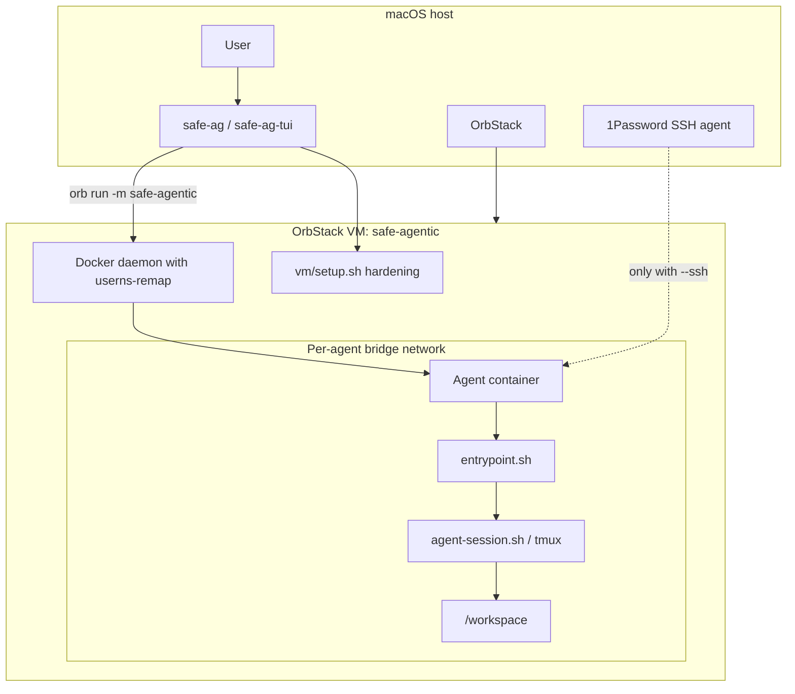

# Architecture

safe-agentic runs Go-hosted orchestration on macOS, then executes agents inside Docker containers inside an OrbStack VM.

## System overview

## Boundaries

1. macOS host -> OrbStack VM
2. OrbStack VM -> Docker container
3. Container -> container via separate networks, volumes, namespaces

## Main components

| Path | Role |
|---|---|
| `cmd/safe-ag` | Go CLI commands |
| `tui/` | Go TUI + dashboard |
| `pkg/docker` | Runtime, network, volume, DinD helpers |
| `pkg/config` | Defaults + identity parsing |
| `vm/setup.sh` | VM hardening + Docker install |
| `entrypoint.sh` | Container boot logic |
| `bin/agent-session.sh` | tmux session launcher |
| `bin/repo-url.sh` | repo URL validation |

## Security posture

- Read-only rootfs
- `cap-drop ALL`
- `no-new-privileges`
- non-root `agent` user
- per-agent bridge network
- auth reuse only by explicit flag
- SSH forwarding only by explicit flag
