# Architecture

## System overview

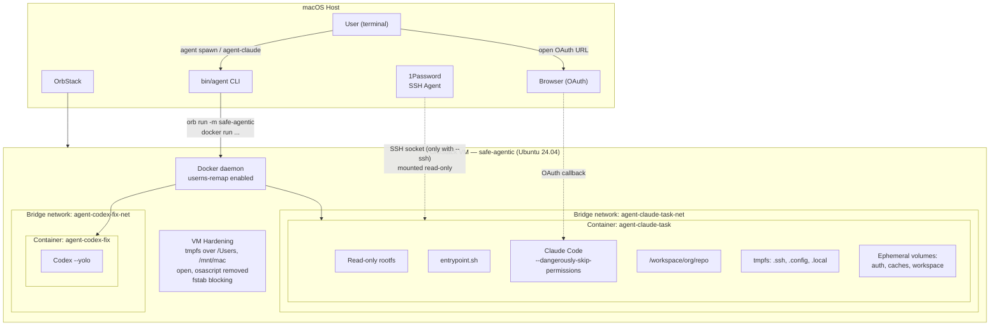

## Isolation boundaries

Three nested boundaries separate the agent from your host:

```mermaid
graph LR
    subgraph B1["Boundary 1: VM"]
        direction TB
        b1_1["macOS mounts blocked<br/>(tmpfs over /Users, /mnt/mac)"]
        b1_2["Integration commands removed<br/>(open, osascript, code)"]
        b1_3["fstab + tmpfs overlay persistence"]
        b1_4["Docker userns-remap"]
    end

    subgraph B2["Boundary 2: Container"]
        direction TB
        b2_1["Read-only root filesystem"]
        b2_2["cap-drop ALL + no-new-privileges"]
        b2_3["Memory / CPU / PID limits"]
        b2_4["Non-root user, no sudo"]
        b2_5["Dedicated bridge network"]
    end

    subgraph B3["Boundary 3: Container-to-container"]
        direction TB
        b3_1["Separate network namespaces"]
        b3_2["Separate volume mounts"]
        b3_3["No shared state"]
    end

    B1 --> B2 --> B3

    style B1 fill:#fee,stroke:#c33
    style B2 fill:#ffd,stroke:#c93
    style B3 fill:#dfd,stroke:#393
```

## Component map

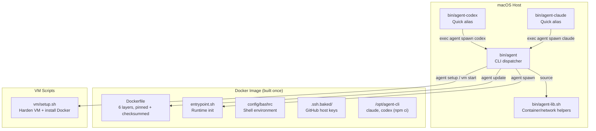

## Flows

### First-time setup

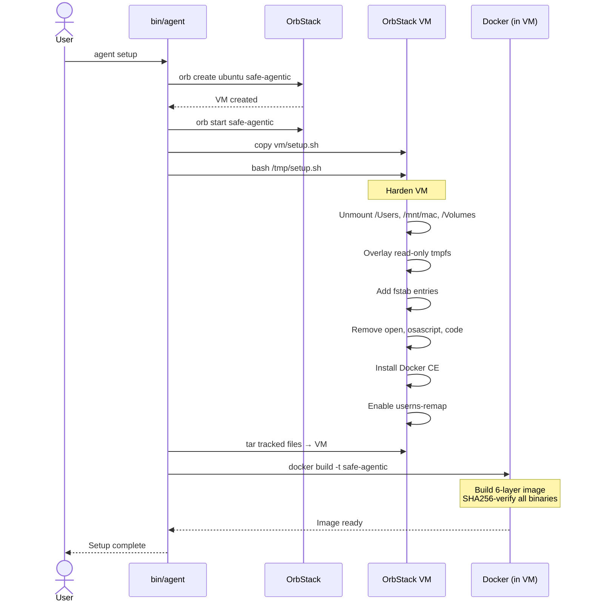

### Spawning an agent

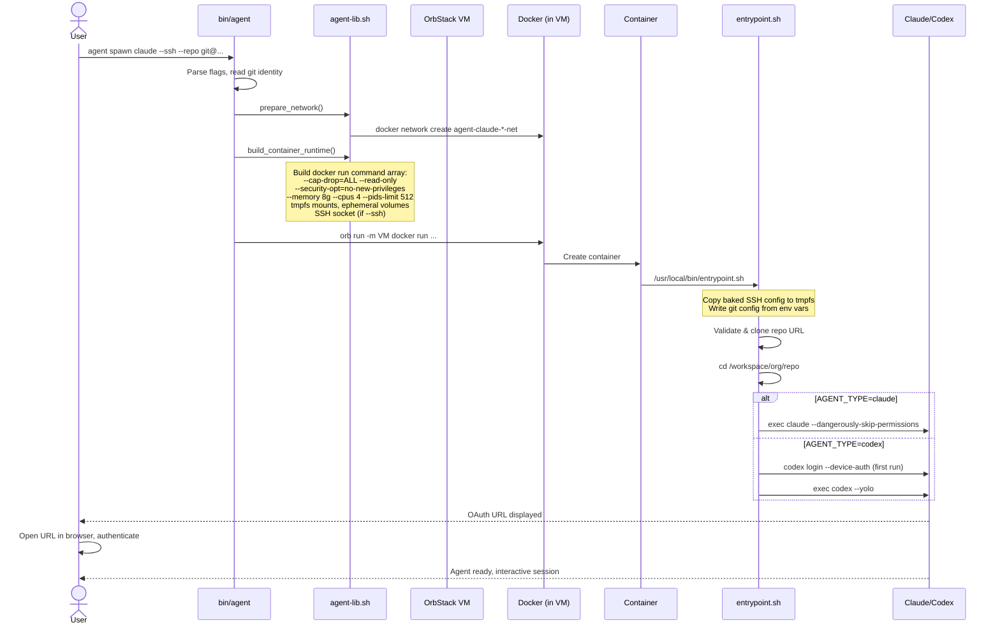

### SSH authentication chain

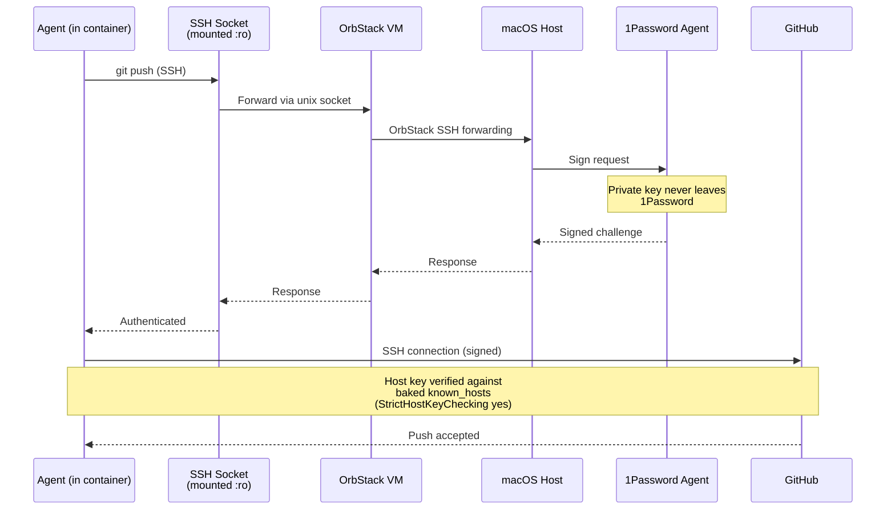

### OAuth authentication flow

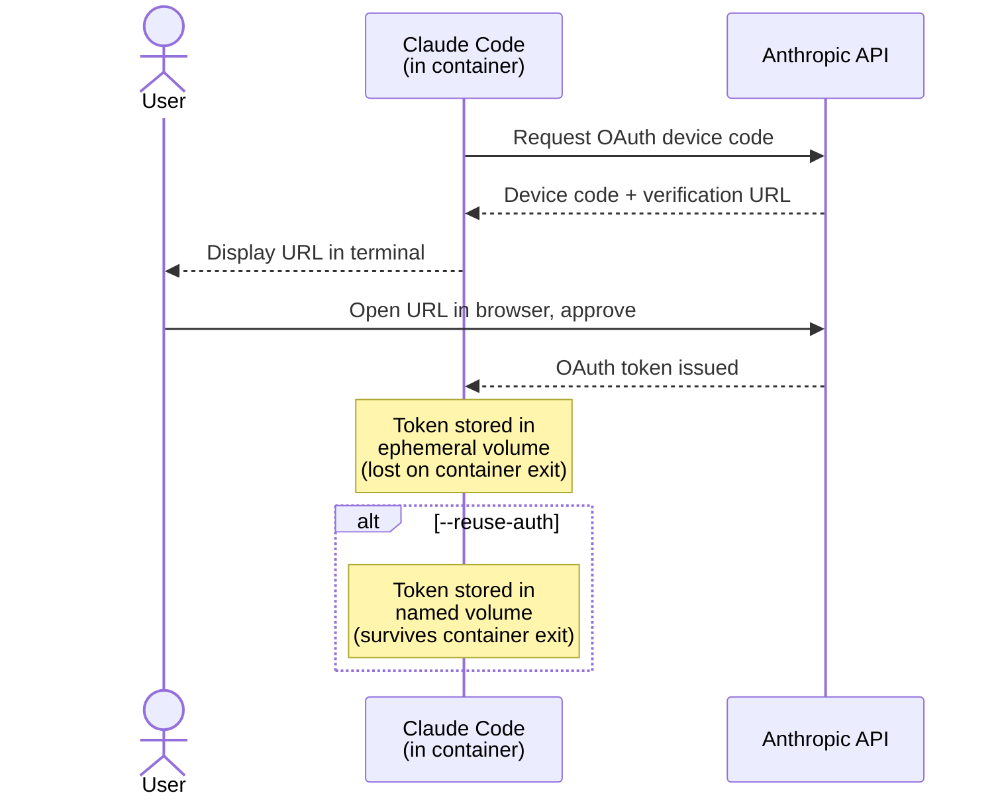

### Container lifecycle

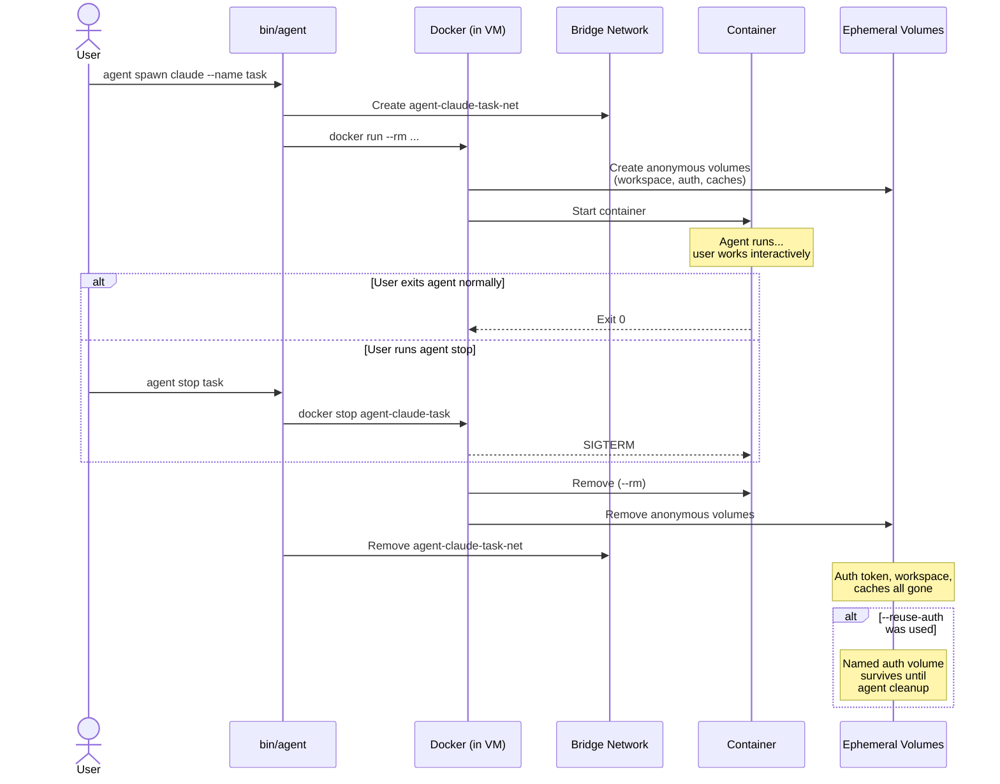

### Image build flow

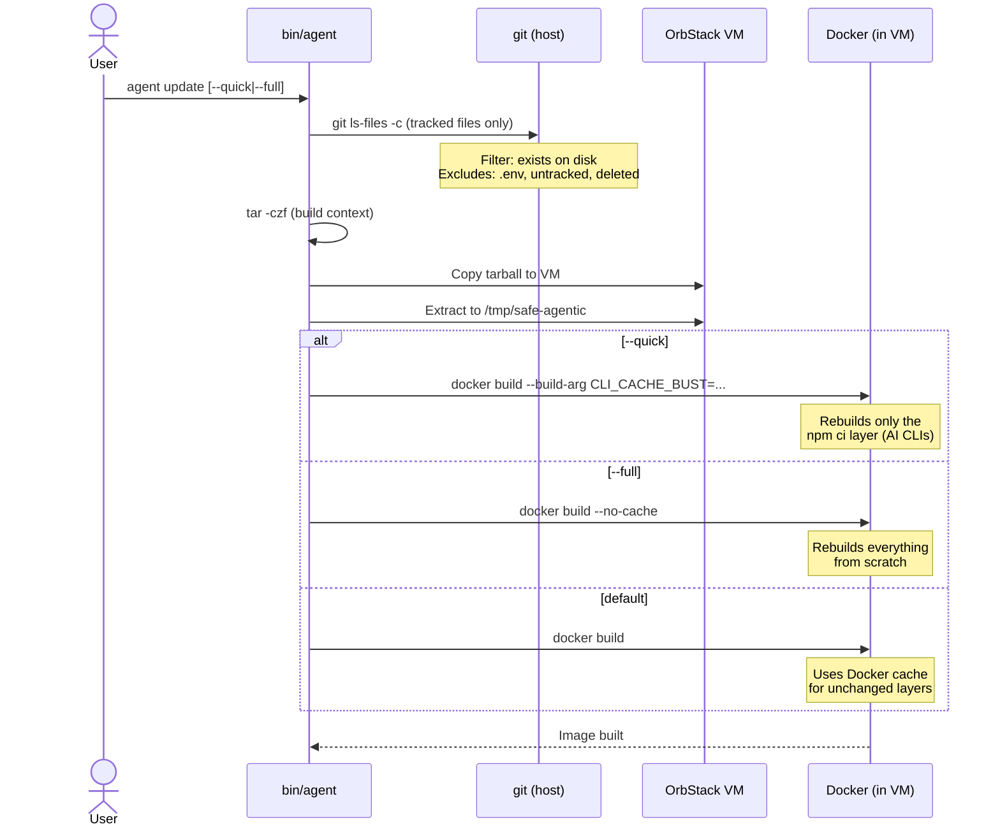

## Container internals

### Filesystem layout

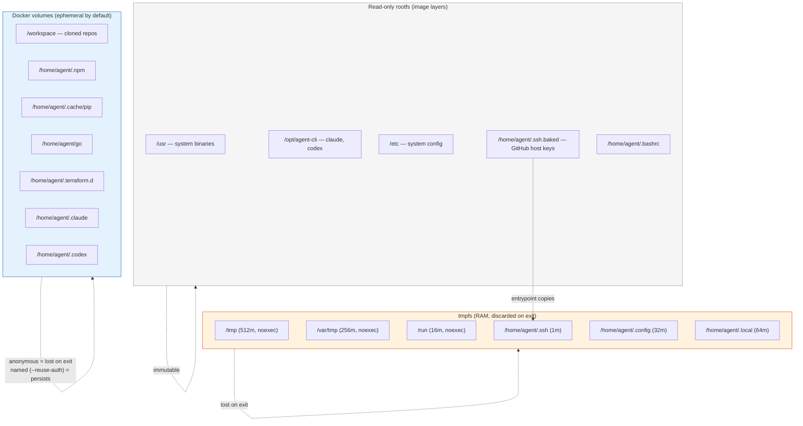

### Docker run flags

Every container is launched with this hardening applied by `agent-lib.sh`:

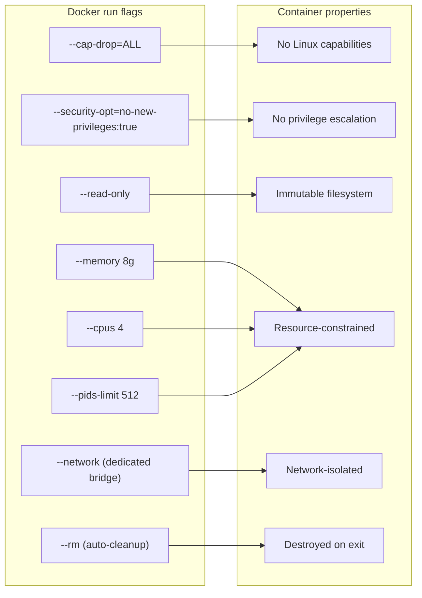

## Network topology

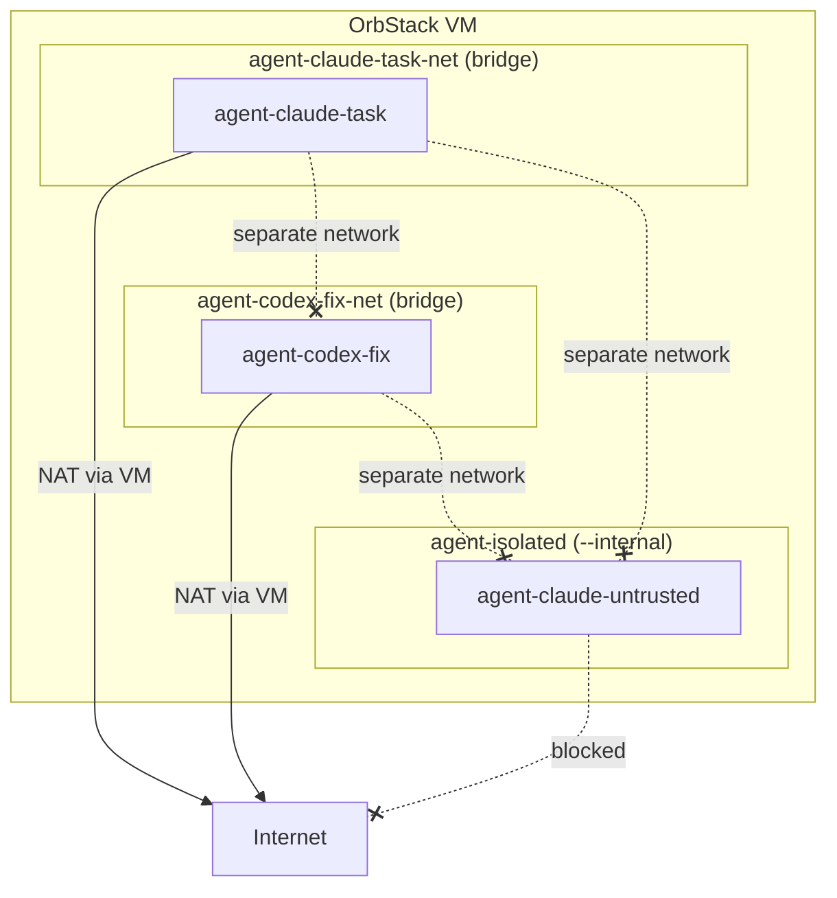

Each container gets its own bridge network by default. Containers cannot communicate with each other unless explicitly placed on the same network. The `--internal` flag on a network blocks internet access entirely.
