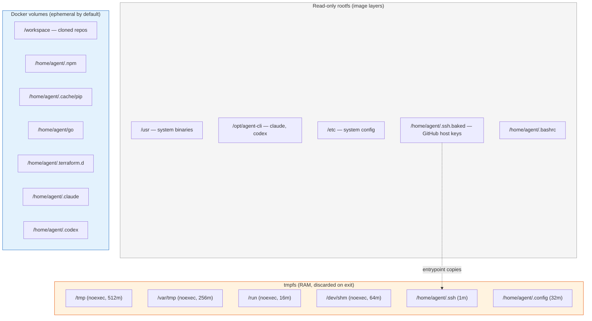
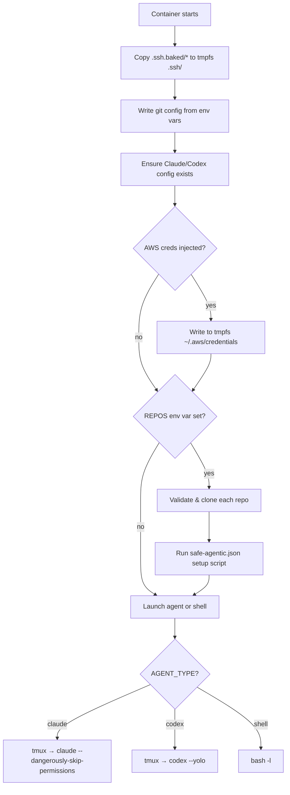
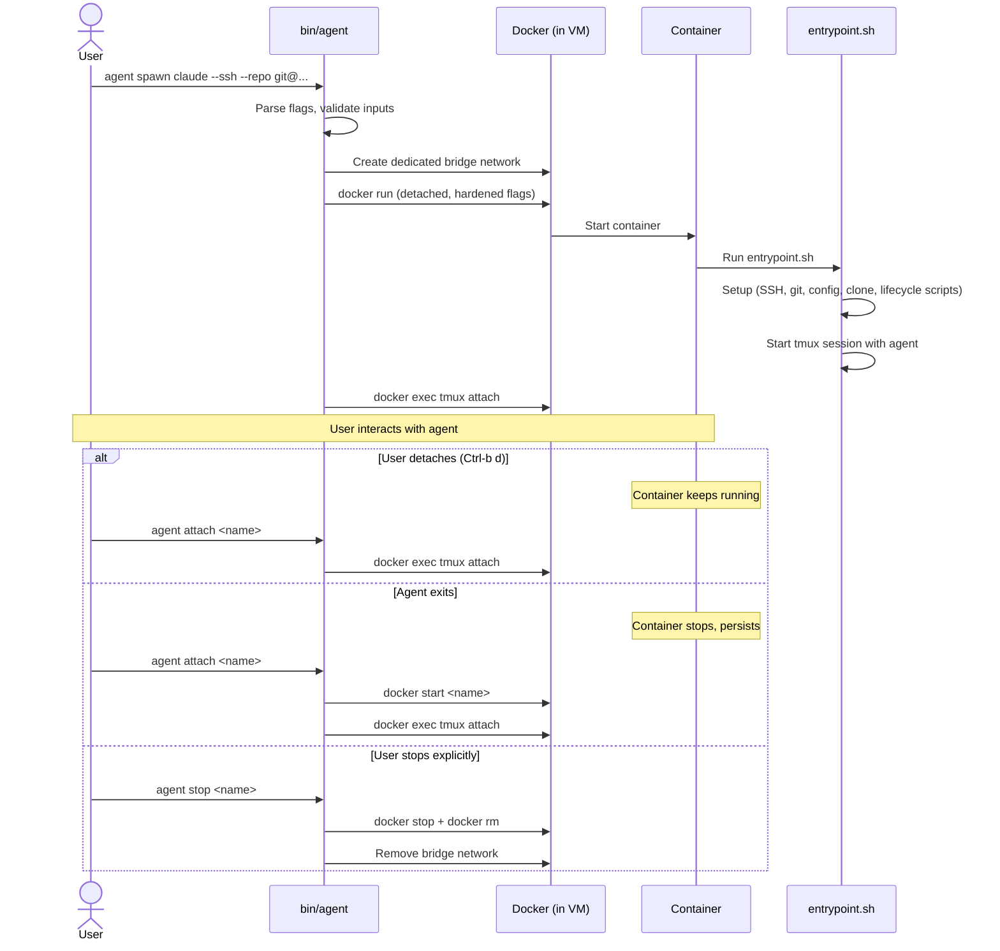

# Container Internals

This page describes what's inside each agent container — the filesystem layout, how the image is built, and the lifecycle from spawn to exit.

## Filesystem layout



### Three types of storage

**Read-only rootfs** — The Docker image layers. Contains all installed tools, system config, and baked SSH host keys. Cannot be modified at runtime. This prevents agents from tampering with their own environment.

**tmpfs (RAM-backed)** — Ephemeral writable paths mounted as tmpfs. Used for SSH config (copied from baked originals), git config, and temporary files. Size-limited and marked `noexec`. Lost when the container exits.

**Docker volumes** — Writable persistent storage for the workspace, caches, and auth tokens. By default these are anonymous volumes (destroyed with the container). With `--reuse-auth`, the auth volume is a named volume that survives container removal.

## Image build

The Dockerfile is a multi-layer build with strict supply chain controls:

1. **Base**: Ubuntu 24.04 pinned by digest (not just tag)
2. **System packages**: Standard apt packages, GPG-verified
3. **Binary tools**: Each binary download is pinned to a specific version and verified with SHA256 checksums
4. **AWS CLI**: Installed via official installer with GPG signature verification
5. **AI CLIs**: Claude Code via official installer (version-pinned, verified by `claude --version`), Codex via `npm ci` with lockfile
6. **User setup**: Non-root `agent` user (UID 1000), no sudo, no supplemental groups

```bash
# Build the image
agent update              # uses Docker cache
agent update --quick      # rebuilds only AI CLI layer
agent update --full       # no cache, rebuilds everything
```

The build context is constructed from `git ls-files -c` filtered by `test -e` — only tracked files that exist on disk are sent. This prevents `.env` files, credentials, or untracked data from leaking into the image.

## Entrypoint flow

When a container starts, `entrypoint.sh` runs through this sequence:



Key security checks during entrypoint:

- **Repo URL validation**: `repo_clone_path()` rejects traversal attacks (`../`), dot-prefixed names, special characters, and non-standard URL schemes. Only `https://`, `ssh://`, and `git@host:org/repo` patterns are accepted.
- **Config writing**: All config writes check for writable directories first. On read-only filesystems, writes are silently skipped.
- **Lifecycle scripts**: `safe-agentic.json` setup scripts run in a subshell with `bash -c`. Failures are warned but don't block agent startup.

## Agent session management

Claude and Codex run inside a tmux session named `safe-agentic`. This enables:

- **Detach without stopping**: `Ctrl-b d` detaches the tmux session while the agent keeps running
- **Reattach**: `agent attach` reconnects to the live tmux session
- **Resume**: If the container was stopped, `agent attach` restarts it and the agent's `--continue` / `resume --last` picks up the previous conversation
- **Preview**: `agent peek` captures the last N lines of the tmux pane without attaching
- **Session state**: A state file at `/workspace/.safe-agentic/started` tracks whether this is a fresh start or resume

## Container lifecycle


