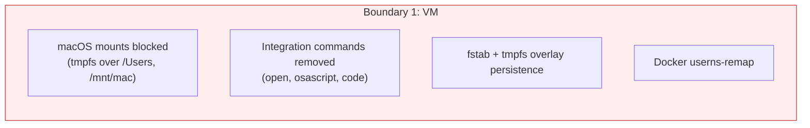
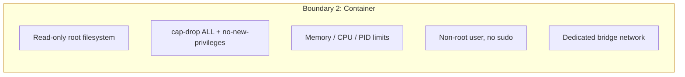
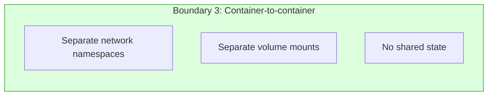

# Isolation Boundaries

Three nested boundaries separate the AI agent from your machine. Each boundary is independent — even if one is bypassed, the others still protect you.

## Boundary 1: OrbStack VM

The outermost boundary is a full Linux VM managed by OrbStack. This is where all Docker containers run.



### What it protects against

**Filesystem access:** OrbStack VMs normally share the macOS filesystem at `/Users`, `/mnt/mac`, and `/Volumes`. safe-agentic mounts tmpfs overlays on all of these, making your host files invisible to anything running in the VM. The overlays are persisted in `/etc/fstab` so they survive reboots.

**macOS integration:** OrbStack provides `open` (launch macOS apps), `osascript` (run AppleScript), and `code` (open VS Code) inside the VM. These are removed during hardening. An agent cannot open URLs, run AppleScript, or trigger IDE actions on your Mac.

**Privilege escalation:** Docker's `userns-remap` maps container UID 0 to an unprivileged UID in the VM. Even a container root escape gives no VM-level privileges.

### How hardening is applied

`vm/setup.sh` runs on every `agent setup` and `agent vm start`:

1. Mounts tmpfs over `/Users`, `/mnt/mac`, `/Volumes`, `/mnt/machines`
2. Adds fstab entries so mounts persist across reboots
3. Removes `open`, `osascript`, `code` symlinks from PATH
4. Installs Docker CE with `userns-remap` in `/etc/docker/daemon.json`
5. Installs socat for SSH agent relay (required for userns-remap compatibility)

### Known limitation

OrbStack does not yet support per-VM file sharing configuration ([issue #169](https://github.com/orbstack/orbstack/issues/169)). The tmpfs overlay approach is a workaround — it blocks access effectively but must be reapplied if OrbStack resets the VM. Always use `agent vm start` instead of starting the VM directly.

## Boundary 2: Docker Container

Each agent runs in its own hardened Docker container with the minimum privileges needed for user-space code execution.



### What it protects against

**System tampering:** Read-only rootfs prevents agents from modifying binaries, installing packages, or creating persistent backdoors. All writable paths are explicit tmpfs mounts or Docker volumes.

**Privilege escalation:** All Linux capabilities are dropped. `no-new-privileges` prevents setuid/setgid binaries from gaining privileges. No sudo is installed. The agent user has no supplemental groups.

**Resource exhaustion:** Memory, CPU, and PID limits prevent a runaway agent from consuming all VM resources and affecting other containers.

**Network lateral movement:** Each container gets a dedicated bridge network. Default egress rules allow only TCP 22 (SSH), 80 (HTTP), 443 (HTTPS). Private/local address ranges are blocked.

### Docker flags applied to every container

```
--cap-drop=ALL
--security-opt=no-new-privileges:true
--read-only
--memory 8g                        (configurable)
--cpus 4                           (configurable)
--pids-limit 512                   (configurable)
--network agent-<name>-net         (dedicated bridge)
--tmpfs /tmp:rw,noexec,nosuid
--tmpfs /home/agent/.ssh:rw,noexec,nosuid
--tmpfs /home/agent/.config:rw,noexec,nosuid
```

These flags are built as bash arrays in `bin/agent-lib.sh` to prevent injection. Unsafe flags (`--privileged`, `host` network, `--` passthrough) are explicitly blocked.

## Boundary 3: Container-to-Container Isolation

Agents cannot see or communicate with each other.



### What it protects against

**Lateral movement:** Each container has its own network namespace. An agent in container A cannot connect to container B's ports, read its files, or send it signals.

**Data leakage:** Each container has its own workspace volume, auth volume, and cache volumes. No shared state exists unless you explicitly reuse auth volumes with `--reuse-auth`.

**Blast radius:** If one agent is compromised (e.g., a malicious repo exploits a vulnerability), the damage is contained to that single container. Other agents continue running safely.

### The exception: shared auth

When you use `--reuse-auth`, multiple containers share the same named auth volume. This is an explicit opt-in trade-off — convenient (no re-auth between sessions) but means a compromised agent could steal the OAuth token. Use ephemeral auth (the default) for untrusted repos.
