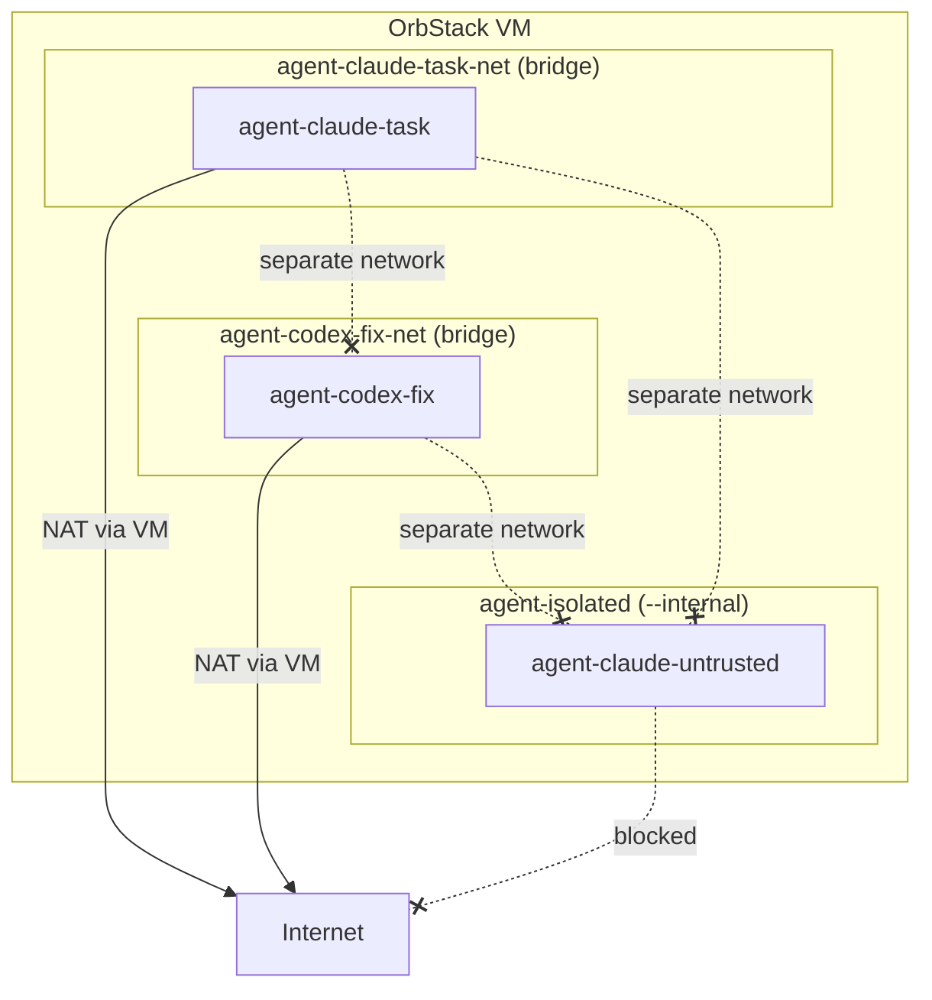
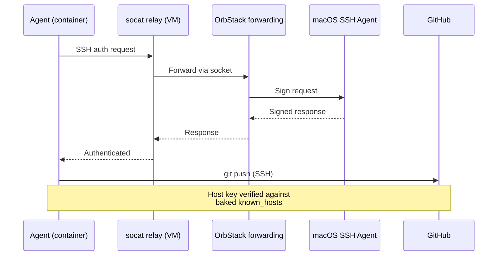

# Networking

Every agent container gets a dedicated Docker bridge network. This page explains the network topology, egress filtering, and isolation model.

## Network topology



## Default: managed bridge networks

When you spawn an agent without `--network`, safe-agentic creates a dedicated bridge network named `agent-<name>-net`. This network:

- Is created before the container starts
- Is removed when the container is stopped
- Has iptables rules blocking private/local egress (10.0.0.0/8, 172.16.0.0/12, 192.168.0.0/16, link-local)
- Allows only outbound TCP on ports 22 (SSH/git), 80 (HTTP), and 443 (HTTPS)

This means agents can clone repos, fetch packages, and call APIs — but cannot reach your local network, other containers, or host services.

## Custom networks

Pass `--network <name>` to join an existing Docker network:

```bash
agent spawn claude --network my-shared-net --repo ...
```

Custom networks bypass safe-agentic's egress filtering. You control the network's configuration. The following network modes are blocked for safety:

- `host` — shares the VM's network namespace (full network access)
- `bridge` — the default Docker bridge (shared with all containers)
- `container:<name>` — shares another container's network namespace

## Isolated networks (no internet)

For untrusted repos, create an internal network with no internet access:

```bash
# Create the network (one-time, inside the VM)
agent vm ssh
docker network create --internal agent-isolated
exit

# Spawn on the isolated network
agent spawn claude --repo https://github.com/untrusted/repo.git --network agent-isolated
```

The `--internal` flag prevents any outbound traffic. The agent can work on code but cannot exfiltrate data, phone home, or access external services.

## SSH forwarding

SSH agent forwarding is opt-in via `--ssh`. The mechanism:

1. safe-agentic detects the SSH agent socket in the VM (forwarded from macOS by OrbStack)
2. Because userns-remap changes container UIDs, the container user can't read the original socket
3. A socat relay creates a world-accessible copy of the socket at `/tmp/safe-agentic-ssh-agent.sock`
4. The relay socket is mounted read-only into the container at `$SSH_AUTH_SOCK`



The SSH socket is mounted `:ro` — the agent cannot modify or replace it. GitHub host keys are baked into the image with `StrictHostKeyChecking yes`, preventing man-in-the-middle attacks.
