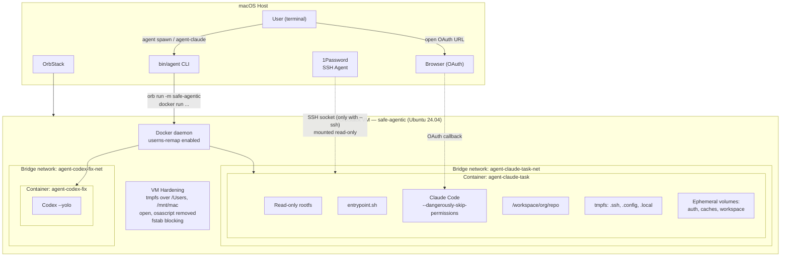
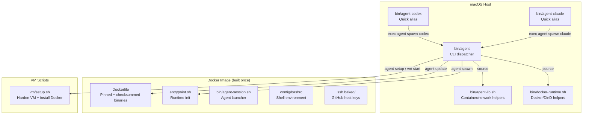

# Architecture Overview

safe-agentic creates a multi-layered sandbox for AI coding agents. The design philosophy is **safe by default** — every dangerous capability (SSH, auth persistence, Docker access, internet) requires explicit opt-in. Inside the sandbox, agents run with full autonomy.

## System diagram

## Key design decisions

### Why OrbStack instead of native Docker?

Docker Desktop on macOS shares the host filesystem by default — containers can read `~/.ssh`, `~/.aws`, browser cookies, and anything else in your home directory. OrbStack VMs provide a real Linux kernel with controllable filesystem sharing. safe-agentic blocks all macOS mount points inside the VM with tmpfs overlays, creating an air gap that Docker Desktop cannot provide.

### Why userns-remap?

Without user namespace remapping, root inside a container is root on the host (within the VM). With `userns-remap`, container UID 0 maps to an unprivileged UID on the host. Even if an agent escapes the container, it has no privileges in the VM.

### Why read-only rootfs?

A read-only root filesystem prevents agents from modifying system binaries, installing backdoors, or tampering with the container's own tooling. All writable paths are explicit — tmpfs for ephemeral data, volumes for workspace and caches.

### Why cap-drop ALL?

Linux capabilities grant specific privileges (mounting filesystems, binding to privileged ports, loading kernel modules, etc.). Dropping all capabilities means the agent process has the minimum privileges needed to run user-space code. Combined with `no-new-privileges`, this prevents any privilege escalation.

### Why per-container networks?

Each container gets its own bridge network so agents cannot communicate with each other. A compromised agent cannot lateral-move to attack other running agents. Network egress is filtered to TCP 22/80/443 only — no arbitrary outbound connections.

## Component map

### Host-side components

| File | Role |
|------|------|
| `bin/agent` | Main CLI dispatcher. All commands are `cmd_*` functions. |
| `bin/agent-lib.sh` | Shared functions: input validation, network lifecycle, container runtime construction, volume helpers. Docker commands built as bash arrays to prevent injection. |
| `bin/docker-runtime.sh` | Docker-in-Docker sidecar and host socket access helpers. |
| `bin/agent-claude`, `bin/agent-codex` | Quick aliases that auto-detect SSH URLs and delegate to `bin/agent spawn`. |
| `bin/agent-session.sh` | Runs inside the container's tmux session. Handles Claude (`--dangerously-skip-permissions` via `script` PTY) and Codex (`--yolo`). |
| `bin/repo-url.sh` | URL parsing and validation. Rejects traversal attacks, dot-prefixed names, special characters. |

### Container-side components

| File | Role |
|------|------|
| `entrypoint.sh` | Container init: copies SSH config to tmpfs, writes git config, injects host config, validates and clones repos, runs lifecycle scripts, launches agent inside tmux. |
| `config/bashrc` | Shell environment with modern tool aliases (rg, fd, bat, eza). |
| `Dockerfile` | Multi-layer image build. All binary downloads pinned with SHA256 checksums or GPG verification. Non-root `agent` user, no sudo. |

### VM-side components

| File | Role |
|------|------|
| `vm/setup.sh` | Idempotent VM bootstrap. Blocks macOS mounts, removes integration commands, installs Docker CE with userns-remap, installs socat for SSH relay. |
