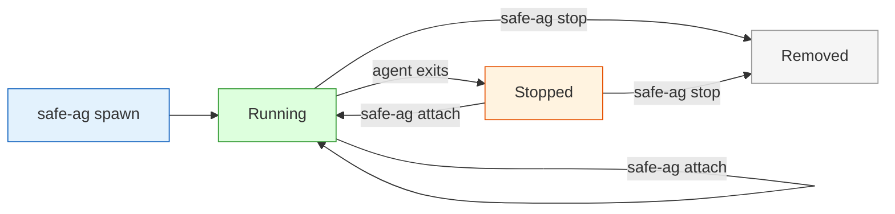

# Managing Agents

## List

```bash
safe-ag list
```

Shows all containers (running + stopped) with name, type, repo, auth, network, and status.

## Attach

```bash
safe-ag attach api-refactor
safe-ag attach --latest
```

Reattaches to the agent's tmux session. If the container is stopped, it restarts first. Detach without stopping: `Ctrl-b d`.

## Peek

```bash
safe-ag peek api-refactor           # last 30 lines
safe-ag peek --latest --lines 50    # more context
```

See what an agent is doing without attaching. Works on running tmux containers only.

## Copy files out

```bash
safe-ag cp api-refactor /workspace/tmp/test.log ./test.log
safe-ag cp --latest /workspace/dist ./dist
```

Extract files from a container without bind mounts.

## Stop

```bash
safe-ag stop api-refactor      # one agent
safe-ag stop --latest          # newest
safe-ag stop --all             # everything
```

Removes the container, its network, and any DinD sidecar.

## Cleanup

```bash
safe-ag cleanup          # stop all, keep auth volumes
safe-ag cleanup --auth   # also remove auth volumes
```

## Export sessions

```bash
safe-ag sessions api-refactor
safe-ag sessions --latest ~/my-sessions/
```

Copies conversation history from the container to host. Works on running and stopped containers.

## Container lifecycle



Containers persist after exit. Reattach to resume, or stop to remove.

## Interactive TUI

```bash
safe-ag tui
```

k9s-style terminal dashboard with live stats (CPU, MEM, PIDs), activity detection, and keybindings for all operations:

| Key | Action | Key | Action |
|-----|--------|-----|--------|
| `a` | Attach | `f` | Diff |
| `r` | Resume | `R` | Review |
| `s` | Stop | `t` | Todos |
| `l` | Logs | `x` | Checkpoint |
| `d` | Describe | `g` | Create PR |
| `n` | New agent | `$` | Cost |
| `p` | Preview | `A` | Audit |
| `e` | Export | `/` | Filter |
| `c` | Copy | `q` | Quit |
