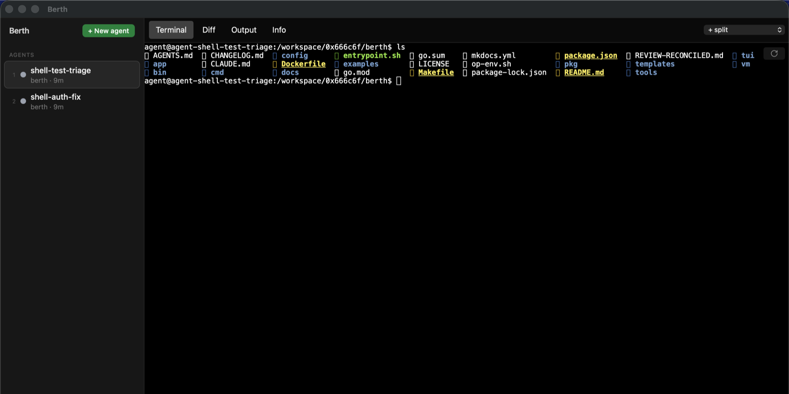

---
hide:
  - navigation
  - toc
---

<div class="bt-home" markdown="1">

<div class="bt-hero" markdown="1">

<div class="bt-hero-left" markdown="1">

# berth

<p class="bt-tagline">Run <strong>Claude Code</strong> and <strong>Codex</strong> in <strong>hardened sandboxes</strong> on macOS. One isolated container per agent — SSH, credentials, and Docker stay off until you opt in.</p>

[Get started](install.md){ .md-button .md-button--primary }
[Quickstart](quickstart.md){ .md-button }
[GitHub](https://github.com/0x666c6f/berth){ .md-button }

<div class="bt-chips">
  <span><b>macOS</b> Apple container VM</span>
  <span><b>isolation</b> container per agent</span>
  <span><b>license</b> MIT</span>
</div>

</div>

<div class="bt-install" markdown="1">
<div class="bt-install-bar">Homebrew</div>

```bash
brew tap 0x666c6f/tap
brew install berth
berth setup
```

</div>

</div>

<div class="bt-grid">
  <a class="bt-card" href="security/">
    <h3>Isolated by default</h3>
    <p>Read-only rootfs, <code>cap-drop ALL</code>, per-agent networks, three boundaries deep. Risky capabilities are explicit flags, never ambient.</p>
    <span class="bt-more">Security model →</span>
  </a>
  <a class="bt-card" href="guide/workflow/">
    <h3>Built for the daily loop</h3>
    <p>Peek, steer, diff, checkpoint, review, and open PRs — without ever attaching a debugger to your own laptop.</p>
    <span class="bt-more">Review &amp; ship →</span>
  </a>
  <a class="bt-card" href="guide/app/">
    <h3>Three interfaces</h3>
    <p>A scriptable CLI, a k9s-style TUI, and a native macOS app with embedded terminals and notifications.</p>
    <span class="bt-more">Desktop app →</span>
  </a>
  <a class="bt-card" href="guide/fleet/">
    <h3>Fleet-scale</h3>
    <p>Parallel fleets, dependency-ordered pipelines, judge stages that pick the best of N, scheduled runs.</p>
    <span class="bt-more">Fleets &amp; pipelines →</span>
  </a>
</div>

## Overview

<div class="bt-steps" markdown="1">

<div class="bt-step" markdown="1">

**Spawn an agent.** Public repos need no flags; add `--ssh` for private ones.

```bash
berth spawn claude --ssh \
  --repo git@github.com:org/api.git \
  --prompt "Fix the failing CI tests"
```

</div>

<div class="bt-step" markdown="1">

**Watch it work — steer when needed.** Agents run in tmux inside their container; you never have to babysit a window.

```bash
berth status --latest     # blocked / working / done / idle
berth peek --latest       # snapshot the live terminal
berth steer --latest "Keep the fix narrow, add one regression test"
```

</div>

<div class="bt-step" markdown="1">

**Review and ship.** Inspect the diff, run a review pass, open the PR.

```bash
berth diff --latest
berth review --latest
berth pr --latest --title "fix: stabilize CI"
```

</div>

</div>

## The desktop app

Berth ships a native macOS app for orchestrating agents: a live sidebar with agent states (working / needs-you / review / failed), embedded terminals attached to each container's tmux session, diff review, a spawn form, timeline and cost views, a ⌘K command palette, and native notifications.

<div class="bt-shot">
  
  <div class="bt-shot-caption">Berth.app — two sandboxed agents; embedded terminal attached to the container's tmux session</div>
</div>

Everything the app does shells out to the same `berth` CLI, so the app, the [TUI](guide/tui.md), and your terminal can drive the same agents interchangeably. [Desktop app guide →](guide/app.md)

## Explore

<div class="bt-grid">
  <a class="bt-card" href="install/">
    <h3>Installation</h3>
    <p>Toolchain, VM setup, migration from safe-agentic.</p>
  </a>
  <a class="bt-card" href="guide/spawning/">
    <h3>Guides</h3>
    <p>Spawning, managing, worktrees, automation, configuration.</p>
  </a>
  <a class="bt-card" href="reference/cli/">
    <h3>Reference</h3>
    <p>Every command and flag; TUI keys; manifest schema.</p>
  </a>
  <a class="bt-card" href="architecture/">
    <h3>Concepts</h3>
    <p>The three isolation boundaries and the threat model.</p>
  </a>
</div>

</div>
