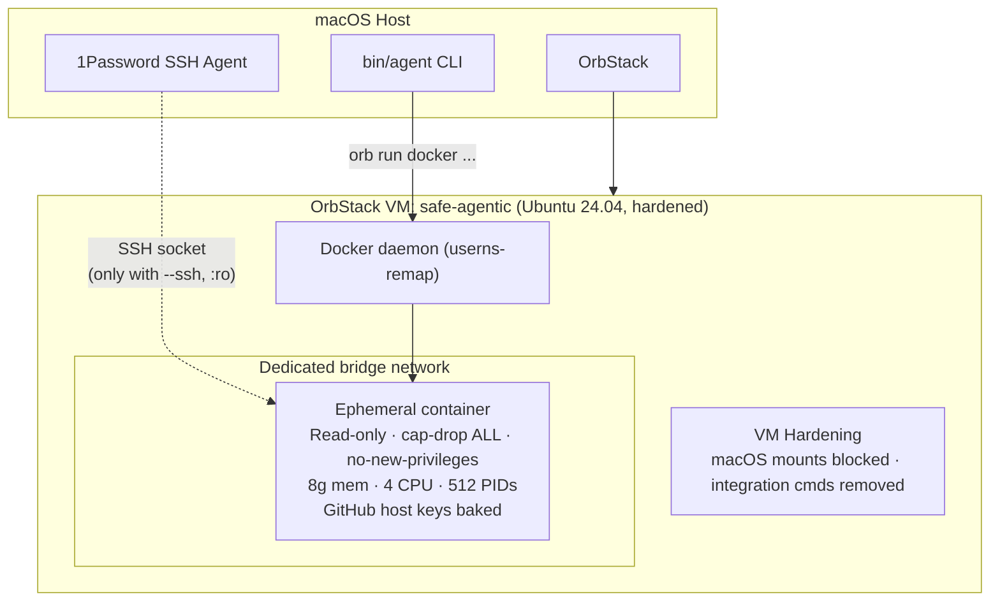

---
hide:
  - navigation
  - toc
---

<div class="hero" markdown>

# Run AI agents safely

Three isolation boundaries. Safe by default. Full agent freedom inside.

<div class="hero-subtitle" markdown>
**safe-agentic** gives Claude Code and Codex a hardened sandbox — an OrbStack VM with Docker containers that drop all capabilities, mount read-only filesystems, and isolate every session with its own network. Dangerous features like SSH forwarding and auth persistence require explicit opt-in.
</div>

```bash
agent setup                                          # one-time
agent-claude git@github.com:myorg/myrepo.git         # spawn
agent diagnose                                       # verify
```

[Get Started](quickstart.md){ .md-button .md-button--primary }
[View on GitHub](https://github.com/morpho-labs/safe-agentic){ .md-button }

</div>

---

## Three isolation boundaries

<div class="grid cards" markdown>

-   :material-shield-lock:{ .lg .middle } **Boundary 1 — OrbStack VM**

    ---

    macOS filesystem mounts blocked with tmpfs overlays. Integration commands (`open`, `osascript`, `code`) removed. Docker userns-remap maps container UIDs to unprivileged host UIDs. Hardening reapplied on every VM start.

-   :material-docker:{ .lg .middle } **Boundary 2 — Docker Container**

    ---

    Read-only rootfs. `cap-drop ALL` + `no-new-privileges`. Memory, CPU, and PID limits. Non-root user with no sudo. Dedicated bridge network per container with egress guardrails (TCP 22/80/443 only).

-   :material-lan-disconnect:{ .lg .middle } **Boundary 3 — Container Isolation**

    ---

    Every agent gets its own network namespace, volume mounts, and workspace. No shared state between containers. Agents cannot communicate with each other unless explicitly placed on the same network.

</div>

---

## Features

<div class="grid cards" markdown>

-   :material-security:{ .lg .middle } **Isolation & Security**

    ---

    Read-only rootfs, dropped capabilities, seccomp, userns-remap, per-container networks with egress filtering, baked GitHub host keys with `StrictHostKeyChecking yes`. Build context sends only git-tracked files.

-   :material-play-circle:{ .lg .middle } **Agent Lifecycle**

    ---

    `--prompt` for immediate task start. Tmux-backed reattach. Container persistence across exits. List, attach, stop, cleanup, copy files out, peek at output, diagnose issues, export session history.

-   :material-source-branch:{ .lg .middle } **Developer Workflow**

    ---

    `agent diff` to review changes. `agent checkpoint` for snapshots. `agent todo` for merge gates. `agent pr` to push and create PRs. `agent review` for AI code review. Lifecycle scripts via `safe-agentic.json`.

-   :material-key-variant:{ .lg .middle } **Auth & Config**

    ---

    SSH forwarding via socat relay (`--ssh`). Persistent OAuth (`--reuse-auth`). GitHub CLI auth (`--reuse-gh-auth`). AWS credential injection (`--aws`). MCP OAuth login. Host config auto-injection for MCP servers and model settings.

-   :material-rocket-launch:{ .lg .middle } **Fleet & Orchestration**

    ---

    `agent fleet manifest.yaml` to spawn multiple agents from a YAML manifest. `agent pipeline pipeline.yaml` for multi-step workflows with retry, dependencies, and failure handlers.

-   :material-chart-line:{ .lg .middle } **Analytics**

    ---

    `agent cost` estimates API spend by parsing session token usage. `agent audit` provides an append-only JSONL log of all spawn, stop, and attach operations with timestamps.

-   :material-lan:{ .lg .middle } **Docker & Networking**

    ---

    Per-session Docker-in-Docker (`--docker`) or direct VM socket (`--docker-socket`). Dedicated bridge networks per container. Custom or isolated networks via `--network`. Multi-repo cloning into a single container.

-   :material-toolbox:{ .lg .middle } **Modern Tooling**

    ---

    Claude Code, Codex, terraform, kubectl, helm, aws-cli, vault, docker, ripgrep, fd, bat, eza, zoxide, fzf, jq, yq, delta, gh. Node.js 22, pnpm, Bun, Python 3.12, Go 1.23.

</div>

---

## Security defaults

Everything is locked down unless you explicitly opt in.

| Feature | Default (safe) | Opt-in override |
|---------|---------------|-----------------|
| SSH agent | **OFF** | `--ssh` (socat relay for userns-remap compat) |
| Auth persistence | **Ephemeral** per-session volume | `--reuse-auth` |
| GitHub CLI auth | **Ephemeral** per-session volume | `--reuse-gh-auth` |
| AWS credentials | **OFF** | `--aws <profile>` (tmpfs-backed) |
| Docker access | **OFF** | `--docker` (DinD) / `--docker-socket` |
| Root filesystem | **Read-only** | -- |
| Capabilities | **Dropped** (`ALL`) + `no-new-privileges` | -- |
| Network | **Dedicated bridge** per container; private/local egress blocked; TCP 22/80/443 only | `--network <name>` |
| Resource limits | `--memory 8g --cpus 4 --pids-limit 512` | explicit flags |
| GitHub host keys | **Baked & pinned** (`StrictHostKeyChecking yes`) | -- |
| Sudo | **Removed** | -- |

---

## Architecture



[Full architecture docs](architecture.md){ .md-button }

---

## Command reference

| Command | Description |
|---------|-------------|
| `agent setup` | Create VM, harden, build image |
| `agent spawn claude/codex` | Launch agent in sandboxed container |
| `agent-claude <url>` | Quick alias (auto-detects SSH) |
| `agent-codex <url>` | Quick alias (auto-detects SSH) |
| `agent list` | Show running + stopped containers |
| `agent attach <name>` | Reattach to agent session |
| `agent stop <name\|--all>` | Stop and remove containers |
| `agent cleanup [--auth]` | Full cleanup with optional auth wipe |
| `agent diff <name>` | Git diff from agent's working tree |
| `agent checkpoint` | Create/list/revert snapshots |
| `agent todo` | Track merge requirements |
| `agent pr <name>` | Create PR from agent's branch |
| `agent review <name>` | AI code review |
| `agent fleet manifest.yaml` | Spawn from YAML manifest |
| `agent pipeline pipeline.yaml` | Multi-step workflows |
| `agent cost <name>` | Estimate API spend |
| `agent audit` | View operation log |
| `agent peek <name>` | View agent output without attaching |
| `agent diagnose` | Health check |
| `agent update [--quick\|--full]` | Rebuild image |
| `agent vm start/stop/ssh` | VM management |

[Full usage guide](usage.md){ .md-button }
[Security model](security.md){ .md-button }
