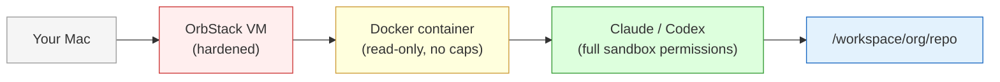

# Quickstart

Get a sandboxed Claude Code or Codex session in under 5 minutes.

## 1. Install prerequisites

```bash
brew install orbstack
```

Enable 1Password SSH agent (optional, needed for private repos):
**1Password → Settings → Developer → "Use the SSH Agent"**

## 2. Add to PATH

```bash
# Add to ~/.zshrc or ~/.bashrc
export PATH="$PATH:/path/to/safe-agentic/bin"
```

## 3. One-time setup

```bash
agent setup
```

This creates a hardened OrbStack VM, installs Docker inside it, and builds the agent image. Takes ~5 minutes on first run.

## 4. Spawn an agent

```bash
# Public repo (no SSH needed)
agent-claude https://github.com/myorg/myrepo.git

# Private repo (auto-enables SSH)
agent-claude git@github.com:myorg/myrepo.git

# Codex instead of Claude
agent-codex git@github.com:myorg/myrepo.git

# Keep auth + set git identity
agent-claude --reuse-auth --identity 'You <you@example.com>' git@github.com:myorg/myrepo.git
```

That's it. The agent launches inside a hardened container with your repo cloned. Claude and Codex use `tmux` for reattach. On first run, you'll see an OAuth URL — open it in your browser to log in.

## 5. When you're done

If you're in a tmux-backed agent session, detach and leave it running with `Ctrl-b d`. If the session exits, the container persists and you can reattach with `agent attach --latest`. To remove containers:

```bash
agent stop --all             # stop and remove all agent containers
agent cleanup --auth         # optional: also remove shared auth volumes
```

If setup or spawn fails, run `agent diagnose`.

## What happens under the hood



The agent has full freedom **inside** the container but can't escape it. SSH keys are only forwarded if you use a `git@` URL. Auth tokens live in ephemeral volumes unless you use `--reuse-auth`.

## Next steps

- [Architecture](architecture.md) — system overview, diagrams, and component map
- [Usage guide](usage.md) — all commands, options, defaults, and troubleshooting
- [Security model](security.md) — what's protected and what's not
