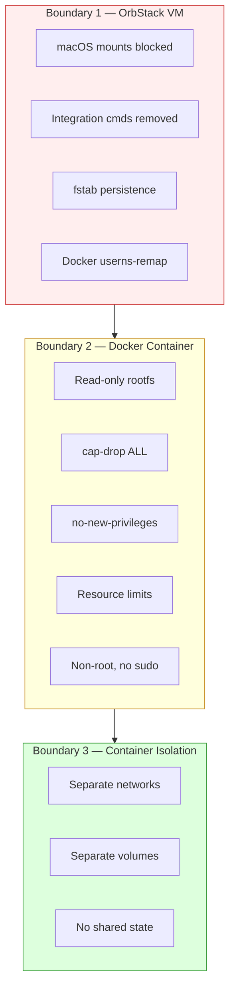
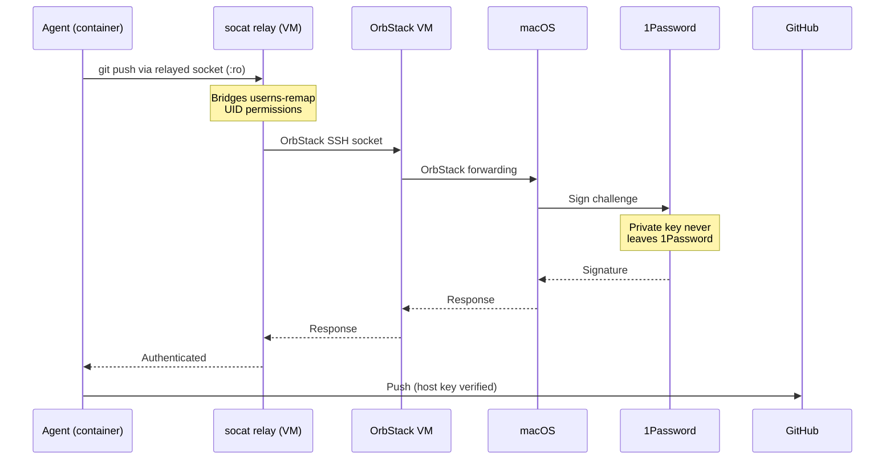
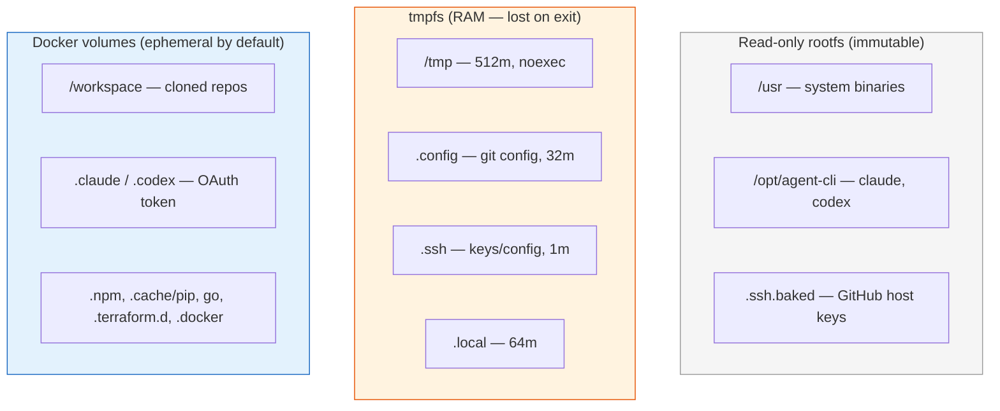

# Security Model

> See [architecture.md](architecture.md) for full system diagrams, sequence flows, and component maps.

## Three isolation boundaries

## Defaults vs opt-in

| Feature | Default (safe) | Opt-in (wider surface) |
|---------|---------------|----------------------|
| SSH agent | OFF — no access to your keys | `--ssh` forwards 1Password agent |
| Auth tokens | Ephemeral — discarded on exit | `--reuse-auth` persists across sessions |
| GitHub CLI auth | Ephemeral — discarded on exit | `--reuse-gh-auth` persists across sessions |
| AWS credentials | OFF — no access to AWS | `--aws <profile>` injects from `~/.aws/credentials` (tmpfs-backed) |
| Docker access | OFF | `--docker` starts DinD; `--docker-socket` mounts the VM daemon |
| Rootfs | Read-only | — |
| Capabilities | ALL dropped + no-new-privileges | — |
| Network | Dedicated bridge per container; private/local egress blocked; TCP 22/80/443 only | `--network <name>` joins existing and bypasses managed guardrails |
| Resources | 8g memory, 4 CPUs, 512 PIDs | `--memory`, `--cpus`, `--pids-limit` |
| Host keys | GitHub baked + StrictHostKeyChecking | — |
| Sudo | Removed | — |

## What each flag exposes

### `--ssh`

Forwards your 1Password SSH agent socket into the container via a socat relay in the VM:

The socat relay is needed because Docker userns-remap maps container UIDs to unprivileged VM UIDs that cannot read the OrbStack SSH socket directly. The relay listens on a world-accessible socket and forwards to the real OrbStack socket.

The agent can:
- Clone and push to any repo your SSH key has access to
- Authenticate to any SSH host your key works with

It **cannot** read your private key (1Password agent never exposes it).

**When to use:** Private repos (`git@` URLs).
**Risk:** A compromised agent could push malicious code to repos you have write access to.

### `--reuse-auth`

Stores the OAuth token in a named Docker volume that survives container restarts.

**When to use:** Avoid re-authenticating every session.
**Risk:** A compromised container could steal the token from the shared volume. Run `safe-ag cleanup --auth` to revoke.

### `--reuse-gh-auth`

Stores GitHub CLI auth in a named Docker volume (`agent-gh-auth`) that survives container restarts.

**When to use:** You want `gh auth login` once and reuse it across sessions.
**Risk:** A compromised container could steal the GitHub token from the shared volume. Run `safe-ag cleanup --auth` to revoke.

### `--aws <profile>`

Injects AWS credentials from the host's `~/.aws/credentials` file into the container. Credentials are written to a tmpfs mount at `~/.aws/credentials` and `AWS_PROFILE` is set. Use `safe-ag aws-refresh` to update expired credentials without restarting.

**When to use:** The agent needs AWS access (terraform, aws-cli, boto3).
**Risk:** A compromised container could use the injected credentials for the session duration. Assumed-role sessions expire (~1 hour), limiting the window. Credentials live on tmpfs and are not persisted to disk.

### `--docker`

Starts a dedicated privileged Docker-in-Docker sidecar for the session and points the agent container at its socket.

**When to use:** The agent needs `docker build`, `docker run`, or Compose, but you do not want to hand it the VM daemon directly.
**Risk:** Wider container attack surface than the default session. The sidecar is still isolated to the session and removed on exit.

### `--docker-socket`

Mounts `/var/run/docker.sock` from the hardened VM directly into the agent container.

**When to use:** You explicitly want the agent to control the VM Docker daemon.
**Risk:** Broadest Docker access. The agent can inspect, stop, or replace other containers in the VM.

### `--network <name>`

Joins an existing Docker network instead of creating a dedicated one.

**When to use:** Multiple containers that need to communicate, or `--network agent-isolated` for air-gapped operation.
**Risk:** Containers on the same network can reach each other, and custom networks bypass the managed egress policy.

## Managed-network egress guardrails

Safe-agentic-managed bridges now get a VM firewall policy:

- outbound TCP only on `22`, `80`, `443`
- no access to local/private address ranges (`127.0.0.0/8`, `10.0.0.0/8`, `172.16.0.0/12`, `192.168.0.0/16`, etc.)
- no access to OrbStack/macOS mount paths when hardening is healthy

This keeps default safe-ag sessions usable for Git, package downloads, and Claude/Codex traffic while blocking the most dangerous east-west and local-host pivots. If you need broader network access, you must opt into a custom network explicitly.

## Supply chain hardening

All binaries installed in the Docker image are verified:

| Source | Verification |
|--------|-------------|
| Direct downloads (Go, Helm, eza, zoxide, yq, delta) | SHA256 checksum pinned per-architecture |
| AWS CLI | GPG signature verified against embedded public key |
| Apt packages (Node.js, Terraform, kubectl, gh, etc.) | Signed apt repositories with pinned GPG keys |
| AI CLIs (Claude Code, Codex) | npm lockfile pinned (`npm ci`) |

No `curl | bash` install patterns are used.

## Container filesystem layout

All writable areas are either tmpfs (discarded on exit) or anonymous Docker volumes (discarded on `safe-ag cleanup`). Named volumes from `--reuse-auth` and `--reuse-gh-auth` persist until `safe-ag cleanup --auth`.

## Git identity

Containers default to `Agent <agent@localhost>`. The host git identity is not copied in automatically.

If you need explicit attribution, export `GIT_AUTHOR_NAME` / `GIT_AUTHOR_EMAIL` (and optionally `GIT_COMMITTER_*`) before launching the container.

## VM hardening details

`vm/setup.sh` applies these protections every time the VM starts:

1. **Unmounts macOS paths** — `/Users`, `/mnt/mac`, `/Volumes`, `/private`, `/opt/orbstack`
2. **Overlays read-only tmpfs** — even if OrbStack re-mounts, the tmpfs hides the content
3. **Adds fstab entries** — persist blocking across VM reboots
4. **Removes OrbStack integration commands** — `open`, `osascript`, `code`, `mac`
5. **Masks OrbStack integration directories** — tmpfs over `/opt/orbstack-guest/`
6. **Verifies hardening** — checks that mounts are blocked and commands are gone
7. **Enables Docker userns-remap** — container UIDs are remapped to unprivileged host UIDs
8. **Installs socat** — required for the SSH agent relay (bridges userns-remap UID permissions) and MCP port bridging

### Known limitation

OrbStack may restore macOS mounts when the VM restarts. Always use `safe-ag vm start` (which re-applies hardening) instead of `orb start` directly.
