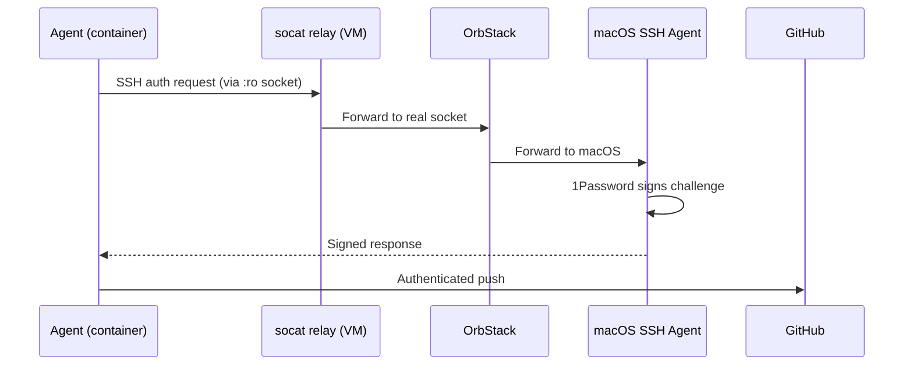

# Threat Surface per Flag

Each opt-in flag expands the attack surface. This page documents exactly what each flag exposes, when to use it, and the associated risks.

## `--ssh` — SSH Agent Forwarding

**What it does:** Forwards your SSH agent socket (typically 1Password) into the container via a socat relay in the VM.

**Mechanism:**

**Why the relay exists:** Docker userns-remap maps container UIDs to unprivileged VM UIDs. The remapped UID can't read the original OrbStack SSH socket (owned by the host user). The socat relay creates a world-accessible copy.

**The agent can:**

- Clone and push to any repo your SSH key can access
- Authenticate to any SSH host your key works with
- Sign git commits (if your SSH key is configured for signing)

**The agent cannot:**

- Read your private key (1Password never exposes it)
- Modify the SSH socket (mounted read-only)
- Use the socket after the container exits

**When to use:** Private repos with `git@` URLs.

**Risk:** A compromised agent could push malicious code to any repo you have write access to.

## `--reuse-auth` — Persistent OAuth Tokens

**What it does:** Stores the Claude/Codex OAuth token in a named Docker volume (`safe-ag spawn claude --repo-auth` or `safe-ag spawn codex --repo-auth`) instead of an anonymous volume.

**The agent can:**

- Access its own OAuth token (same as without the flag)

**The risk:**

- A second container with `--reuse-auth` shares the same volume — it reads the token
- If the volume is compromised, the attacker gets a valid API token
- The token survives container removal until `safe-ag cleanup --auth`

**When to use:** Avoid re-authenticating every session.

**Mitigation:** Run `safe-ag cleanup --auth` to destroy the volume and invalidate the token.

## `--reuse-gh-auth` — Persistent GitHub CLI Auth

**What it does:** Stores `gh auth login` state in a named Docker volume (`agent-gh-auth`).

**Risk:** Same as `--reuse-auth` — shared across containers, survives removal, can be stolen by a compromised agent.

**When to use:** You run `gh` commands frequently and don't want to re-login.

## `--aws <profile>` — AWS Credential Injection

**What it does:** Reads the specified profile from your host `~/.aws/credentials` and writes it into the container at `~/.aws/credentials` on a tmpfs mount.

**The agent can:**

- Make AWS API calls using the injected credentials
- Assume roles, access S3, modify infrastructure — whatever the profile allows

**Mitigations:**

- Credentials live on tmpfs — not persisted to a Docker volume
- Assumed-role sessions expire (~1 hour), limiting the attack window
- `safe-ag aws-refresh` re-injects credentials without restarting the container

**When to use:** Infrastructure work (terraform, aws-cli, boto3).

**Risk:** A compromised agent has full access to whatever the AWS profile allows for the session duration. Use least-privilege IAM roles.

## `--docker` — Docker-in-Docker

**What it does:** Starts a privileged Docker-in-Docker (DinD) sidecar container and points the agent at its socket.

**The agent can:**

- Build Docker images
- Run containers inside its own DinD daemon
- Use Docker Compose

**The agent cannot:**

- Access the VM's Docker daemon or other agent containers
- The DinD sidecar is destroyed when the agent stops

**When to use:** The agent needs to build or test containerized applications.

**Risk:** The DinD sidecar runs privileged (required for nested Docker). This is isolated to a per-session daemon — not shared with the VM.

## `--docker-socket` — VM Docker Socket

**What it does:** Mounts `/var/run/docker.sock` from the VM directly into the agent container.

**The agent can:**

- Inspect, start, stop, and remove ANY container in the VM
- Pull and build images
- Create networks and volumes
- See other running agent containers

**When to use:** Only when you explicitly need VM-level Docker control.

**Risk:** This is the broadest Docker access. A compromised agent can interfere with all other containers.

## `--network <name>` — Custom Network

**What it does:** Joins an existing Docker network instead of creating a dedicated managed bridge.

**The agent can:**

- Communicate with other containers on the same network
- Bypass managed egress filtering (port restrictions, private IP blocking)

**When to use:** Containers that need to talk to each other, or `--network agent-isolated` for air-gapped operation.

**Risk:** Custom networks opt out of safe-agentic's egress guardrails. You're responsible for the network's security configuration.
