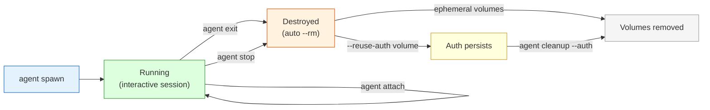
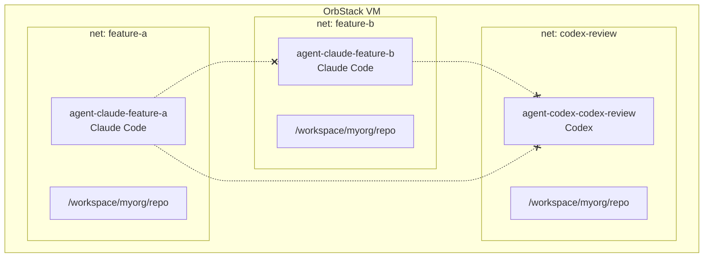

# Usage Guide

> See [architecture.md](architecture.md) for system diagrams and sequence flows.

## Commands at a glance

| Command | What it does |
|---------|-------------|
| `agent setup` | First-time: create VM, harden it, build image |
| `agent spawn claude` | Launch Claude Code in a sandboxed container |
| `agent spawn codex` | Launch Codex in a sandboxed container |
| `agent-claude <url>` | Shortcut for `agent spawn claude --repo <url>` |
| `agent-codex <url>` | Shortcut for `agent spawn codex --repo <url>` |
| `agent shell` | Interactive shell (no agent, no auth) |
| `agent list` | Show running agent containers |
| `agent attach <name>` | Open a second shell in a running agent |
| `agent stop <name>` | Stop a specific agent |
| `agent stop --all` | Stop all agents |
| `agent cleanup` | Stop all, keep shared auth, prune networks |
| `agent cleanup --auth` | Also remove shared auth volumes |
| `agent diagnose` | Check common setup/runtime issues |
| `agent update` | Rebuild the Docker image |
| `agent vm start` | Start VM and re-apply hardening |
| `agent vm stop` | Stop the VM |
| `agent vm ssh` | SSH into the VM for debugging |

## Spawning agents

### Basic: public repo, no SSH

```bash
agent spawn claude --repo https://github.com/myorg/myrepo.git
```

### Private repo with SSH

```bash
agent spawn claude --ssh --repo git@github.com:myorg/myrepo.git
```

The `--ssh` flag forwards your 1Password SSH agent into the container so `git clone`, `git push`, etc. work with your SSH keys.

By default, safe-agentic-managed networks block private/local egress and only allow outbound TCP `22`, `80`, and `443`. Passing `--network <name>` opts out of those guardrails and joins the named Docker network as-is.

### Quick aliases (recommended)

The aliases auto-detect whether SSH is needed based on the URL:

```bash
# HTTPS repo — no SSH forwarded
agent-claude https://github.com/myorg/myrepo.git

# SSH repo — SSH auto-enabled
agent-claude git@github.com:myorg/myrepo.git

# Codex variant
agent-codex git@github.com:myorg/myrepo.git

# Advanced flags still work
agent-claude --name api-fix --reuse-auth --identity 'You <you@example.com>' git@github.com:myorg/myrepo.git

# GitHub CLI auth + Docker access also pass through
agent-codex --reuse-gh-auth --docker git@github.com:myorg/myrepo.git
```

### Named sessions

Give your session a name so it's easy to find and attach to:

```bash
agent spawn claude --ssh --name api-refactor --repo git@github.com:myorg/api.git
```

The container will be named `agent-claude-api-refactor` (visible in `agent list`).

### Multiple repos

Clone several repos into the same container:

```bash
agent-claude git@github.com:myorg/frontend.git git@github.com:myorg/backend.git
```

Each repo is cloned to `/workspace/org/repo` inside the container.

### Persistent auth

By default, you re-authenticate every time (OAuth token is discarded when the container exits). To keep your login across sessions:

```bash
agent spawn claude --ssh --reuse-auth --repo git@github.com:myorg/myrepo.git
```

The token is stored in a named Docker volume (`agent-claude-auth` / `agent-codex-auth`) that persists until `agent cleanup --auth` or manual volume removal.

### Persistent GitHub CLI auth

`gh` is installed in the image. By default, `gh auth login` state is per-session and disappears on exit.

To persist it:

```bash
agent spawn claude --reuse-gh-auth --repo https://github.com/myorg/myrepo.git
```

This stores GitHub CLI auth in `agent-gh-auth` until `agent cleanup --auth`.

### Docker inside the agent

`docker` and Compose are installed in the image, but daemon access is opt-in:

```bash
# Safer default: per-session Docker-in-Docker sidecar
agent shell --docker --repo https://github.com/myorg/myrepo.git

# Broader access: mount the VM Docker socket directly
agent shell --docker-socket --repo https://github.com/myorg/myrepo.git
```

Use `--docker` unless you explicitly need the VM daemon. `--docker-socket` gives the agent direct control over Docker in the VM.

### Git identity

Containers default to `Agent <agent@localhost>`. If you want commits attributed to you, export identity explicitly before launch:

```bash
GIT_AUTHOR_NAME="Your Name" \
GIT_AUTHOR_EMAIL="you@example.com" \
agent spawn claude --repo https://github.com/myorg/myrepo.git
```

`GIT_COMMITTER_NAME` / `GIT_COMMITTER_EMAIL` are also respected if set.

Or use a one-off flag:

```bash
agent spawn claude --identity "Your Name <you@example.com>" --repo https://github.com/myorg/myrepo.git
```

### Custom resource limits

Defaults: 8 GB memory, 4 CPUs, 512 PIDs. Override when needed:

```bash
agent spawn claude --memory 16g --cpus 8 --pids-limit 1024 --repo https://github.com/myorg/big-repo.git
```

Same flags work for `agent shell`.

### Untrusted repos

For repos you don't trust, create an isolated network with no internet:

```bash
# One-time: create the network inside the VM
agent vm ssh
docker network create --internal agent-isolated
exit

# Spawn without SSH, on the isolated network
agent spawn claude --repo https://github.com/sketchy/repo.git --network agent-isolated
```

The agent can work on the code but can't reach the internet, your SSH keys, or other containers.

## Managing running agents

### List

```bash
agent list
```

Shows all running agent containers with their names, status, and creation time.

### Attach

Open a second shell into a running agent. Useful for checking logs, running tests in parallel, etc.

```bash
agent attach api-refactor
# or with full name:
agent attach agent-claude-api-refactor
agent attach --latest
```

### Stop

```bash
agent stop api-refactor      # Stop one
agent stop --latest          # Stop newest running session
agent stop --all             # Stop all
```

Stopping removes the container and its per-session network.

### Cleanup

```bash
agent cleanup
agent cleanup --auth
```

`agent cleanup` stops containers, removes managed networks, and prunes safe-agentic image layers. Shared auth volumes are kept by default.

Add `--auth` to remove shared auth volumes too.

Older releases removed shared auth volumes on plain `agent cleanup`. Use `agent cleanup --auth` if you want the old full-reset behavior.

### Container lifecycle



## Interactive shell

Get a shell with all the tools but no agent running:

```bash
agent shell --ssh --repo git@github.com:myorg/myrepo.git
```

Same hardening as agent containers (read-only rootfs, dropped capabilities, etc.) but no Claude/Codex auth volumes.

## Image maintenance

### Rebuild image

```bash
agent update              # Standard rebuild (uses Docker cache)
agent update --quick      # Rebuild only the AI CLI layer (fast)
agent update --full       # Full rebuild from scratch (no cache)
```

Use `--quick` after Claude Code or Codex releases a new version. Use `--full` to pick up OS package updates.

Build logs now stream during `agent update`, so long rebuilds stay visible.

Launches are local-image only: if `safe-agentic:latest` is missing in the VM, `agent spawn` / `agent shell` will fail until you run `agent update` or `agent setup`.

### VM management

```bash
agent vm start            # Start VM + re-apply hardening
agent vm stop             # Stop the VM (containers stop too)
agent vm ssh              # Debug the VM itself
agent diagnose            # Check orb/VM/docker/image/SSH/defaults
```

Always use `agent vm start` (not `orb start`) — it re-applies the filesystem hardening that OrbStack may reset.

## Defaults / Profiles

safe-agentic loads `${XDG_CONFIG_HOME:-~/.config}/safe-agentic/defaults.sh` when present.
Use simple `KEY=value` assignments only. The file is treated as config, not sourced as shell.

Example:

```bash
SAFE_AGENTIC_DEFAULT_MEMORY=16g
SAFE_AGENTIC_DEFAULT_CPUS=8
SAFE_AGENTIC_DEFAULT_NETWORK=agent-isolated
SAFE_AGENTIC_DEFAULT_REUSE_AUTH=true
SAFE_AGENTIC_DEFAULT_REUSE_GH_AUTH=true
SAFE_AGENTIC_DEFAULT_DOCKER=true
SAFE_AGENTIC_DEFAULT_SSH=false
SAFE_AGENTIC_DEFAULT_IDENTITY="Your Name <you@example.com>"
```

You can also set `GIT_AUTHOR_NAME`, `GIT_AUTHOR_EMAIL`, `GIT_COMMITTER_NAME`, and `GIT_COMMITTER_EMAIL` directly there if you prefer explicit env vars.

## Troubleshooting

### `No SSH_AUTH_SOCK in VM`

Run:

```bash
agent diagnose
agent vm start
```

If it still fails, confirm 1Password SSH agent is enabled on macOS, then re-run with `--ssh`.

### `Docker may need a re-login for group changes`

Re-run:

```bash
agent vm start
agent diagnose
```

If Docker is still unavailable inside the VM, run `agent setup` again.

### `Image 'safe-agentic:latest' not found in VM`

Run:

```bash
agent update
```

This is expected after a fresh VM or image cleanup.

### OAuth appears to hang

For Claude or Codex first run, wait for the login URL/device code prompt inside the container. If you want to preserve the session afterward, launch with `--reuse-auth`.

## Tools available inside containers

| Category | Tools |
|----------|-------|
| AI agents | `claude`, `codex` |
| SRE | `terraform`, `kubectl`, `helm`, `aws`, `vault`, `docker`, `docker compose` |
| Modern CLI | `rg`, `fd`, `bat`, `eza`, `z` (zoxide), `fzf`, `jq`, `yq`, `delta`, `gh` |
| Runtimes | Node.js 22, `npm`, `pnpm`, `bun`, Python 3.12, Go 1.23 |
| Build | `pip`, `go build`, `docker build` (with `--docker` or `--docker-socket`) |

## Typical workflows

### Daily development

```bash
# Start your session
agent-claude git@github.com:myorg/service.git

# ... Claude Code opens, work as usual ...

# When done, the container is removed automatically on exit
```

### Parallel sessions

Run multiple agents simultaneously on different repos or tasks:

```bash
agent spawn claude --ssh --name feature-a --repo git@github.com:myorg/repo.git
agent spawn claude --ssh --name feature-b --repo git@github.com:myorg/repo.git
agent spawn codex --ssh --name codex-review --repo git@github.com:myorg/repo.git
```

Each gets its own container, network, and workspace — fully isolated from each other:



### Review untrusted code

```bash
agent spawn claude --repo https://github.com/unknown/suspicious.git --network agent-isolated
```

No SSH keys, no internet — the agent can only read and modify the cloned code locally.
